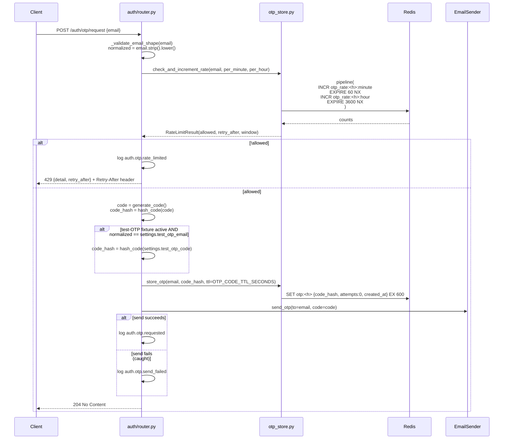
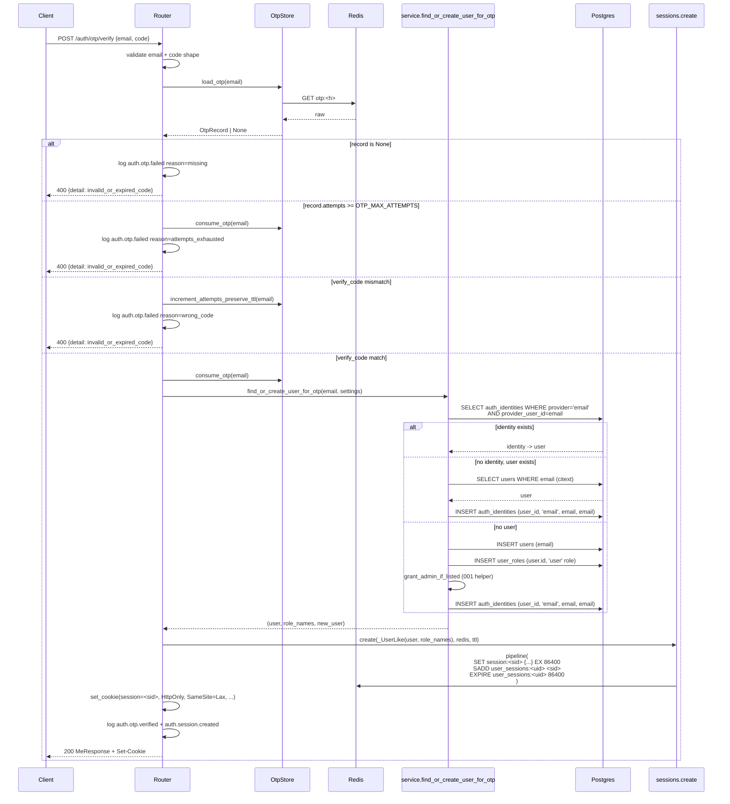

# Design: Email OTP login

## Source of truth

The architectural decisions — why server-side sessions, why bcrypt-hashed
OTP codes, why same-response-for-known-and-unknown emails, why rate-limit
per email hash, the full security posture — live in
**`docs/design/auth-login-and-roles.md`** (committed by `feat_auth_001`).
This design spec does **not** repeat that reasoning. It describes the
concrete file-level work that lands in `feat_auth_002` and references
the design doc by section:

- **§5.1** — module layout under `app/auth/email/` and `app/auth/otp.py`.
- **§6.2** — Redis keyspaces `otp:*`, `otp_rate:*:minute`, `otp_rate:*:hour`.
- **§7.1** — OTP request → verify → session data flow (verbatim contract).
- **§8** — security posture row-set that 002 implements.
- **§10** — log-event vocabulary for the OTP flow.
- **§11** — environment variables (`EMAIL_*` and `OTP_*` blocks).
- **§13** — deployment documentation (`docs/deployment/*`).

When this spec says "per §7.1" it means "see the design doc, section 7.1
— don't duplicate."

## Approach

Five disjoint pieces of work, one build:

1. **Email plumbing.** Ship the `EmailSender` protocol plus two
   implementations (`ConsoleEmailSender`, `ResendEmailSender`) and a
   provider factory. Instance lives on `app.state.email_sender`, set
   during lifespan startup.
2. **OTP primitives.** `app/auth/otp.py` (pure helpers: hash, verify,
   generate, key helpers) and `app/auth/otp_store.py` (Redis I/O:
   store, load, increment-preserve-ttl, consume, rate-limit).
3. **Endpoints.** `POST /auth/otp/request` and `POST /auth/otp/verify`
   added to the existing `app.auth.router.router`. Schemas and a new
   `find_or_create_user_for_otp` service helper.
4. **Test-only OTP fixture.** The `TEST_OTP_EMAIL` / `TEST_OTP_CODE`
   affordance lands inside `/otp/request`, gated on `env == "test"`
   and both values non-empty. No production code path references the
   pair.
5. **Cleanup + docs.** Delete `test_router`, `mint_test_session`,
   `TestSessionRequest`, `find_or_create_user_for_test`, and the
   corresponding test file. Rewrite two 001 tests to mint via OTP.
   Ship `docs/deployment/README.md` + `email-otp-setup.md`. Update
   tracking rows.

Nothing in this feature adds a database migration. The `users`,
`auth_identities`, `user_roles` touches all use 001's schema. Role-
change revocation is available via `service.revoke_sessions_for_user`
(already shipped); 002 does not call it — OTP login creates sessions,
it does not mutate roles.

## Files to Create

| Path | Purpose |
|---|---|
| `backend/app/auth/email/__init__.py` | Package marker. Exposes `EmailSender`, `build_email_sender`, `get_email_sender`, `EmailSendError`, `EmailProviderConfigError`. |
| `backend/app/auth/email/base.py` | `EmailSender` runtime-checkable Protocol plus the two exception classes. |
| `backend/app/auth/email/console.py` | `ConsoleEmailSender` — logs via `app.logging.get_logger`. |
| `backend/app/auth/email/resend.py` | `ResendEmailSender` — thin `httpx.AsyncClient` wrapper over `POST https://api.resend.com/emails`. |
| `backend/app/auth/email/factory.py` | `build_email_sender(settings)` dispatch + startup validation. |
| `backend/app/auth/otp.py` | Pure OTP helpers: `generate_code`, `hash_code`, `verify_code`, `email_hash`, `otp_key`, `rate_limit_keys`. |
| `backend/app/auth/otp_store.py` | Redis I/O for OTP: `OtpRecord`, `RateLimitResult`, `store_otp`, `load_otp`, `increment_attempts_preserve_ttl`, `consume_otp`, `check_and_increment_rate`. |
| `backend/tests/test_auth_otp_helpers.py` | Unit tests for `app/auth/otp.py`. |
| `backend/tests/test_auth_otp_store.py` | Unit tests for `app/auth/otp_store.py` against a real Redis. |
| `backend/tests/test_auth_email_senders.py` | Unit tests for `ConsoleEmailSender` and `ResendEmailSender` (Resend tested against a `respx`-style mocked transport; see note below). |
| `backend/tests/test_auth_email_factory.py` | Unit tests for `build_email_sender` dispatch and validation. |
| `backend/tests/test_auth_otp_request.py` | Endpoint tests for `POST /auth/otp/request` — happy, rate limit, provider failure, same-response parity. |
| `backend/tests/test_auth_otp_verify.py` | Endpoint tests for `POST /auth/otp/verify` — happy, wrong code, expired, attempts exhausted, one-shot, auto-link, `ADMIN_EMAILS` bootstrap. |
| `backend/tests/test_auth_test_otp_fixture.py` | Tests the `TEST_OTP_EMAIL` / `TEST_OTP_CODE` env-gated affordance — active only under `env=test` + both set; inactive otherwise; startup-refusal when set in non-test env. |
| `docs/deployment/README.md` | One-screen index of external-service setup guides. |
| `docs/deployment/email-otp-setup.md` | Operator guide for Resend + the console dev-mode login story. |
| `docs/specs/feat_auth_002/feat_auth_002.md` | Feature spec. |
| `docs/specs/feat_auth_002/design_auth_002.md` | This file. |
| `docs/specs/feat_auth_002/test_auth_002.md` | Test spec. |

**Note on `respx`.** `respx` is an `httpx` mock transport used by many
FastAPI projects for third-party HTTP mocking. It is **not** being
added. The `test_auth_email_senders.py` tests for Resend use `httpx`'s
built-in `MockTransport` (documented at
<https://www.python-httpx.org/advanced/transports/#mock-transport>),
which ships with `httpx` — no new dependency. The assertions check
request method, URL, body JSON, and the `Authorization` header value;
mismatches return synthetic `httpx.Response` objects.

## Files to Modify

| Path | Change |
|---|---|
| `backend/app/auth/schemas.py` | **Add** `OtpRequestIn`, `OtpVerifyIn`. **Delete** `TestSessionRequest` and the now-unused `field_validator` import (keep `_validate_email_shape` — `OtpRequestIn` / `OtpVerifyIn` reuse it verbatim). |
| `backend/app/auth/router.py` | **Add** two new route handlers: `@router.post("/otp/request", status_code=204)` and `@router.post("/otp/verify", status_code=200, response_model=MeResponse)`. **Delete** the `test_router` block (currently lines 114–175), the `_UserLike` helper (now moved next to the verify handler since verify is its only consumer) and the `from types import SimpleNamespace` import if no other user remains. |
| `backend/app/auth/service.py` | **Add** `find_or_create_user_for_otp(session, *, email, settings) -> tuple[User, list[str], bool]` (returns user, role names, `new_user` flag). **Delete** `find_or_create_user_for_test`. `_current_role_names` and `_grant_role_if_missing` stay — `find_or_create_user_for_otp` reuses them. |
| `backend/app/auth/__init__.py` | No change required — still re-exports `router`. |
| `backend/app/main.py` | **Add** lifespan wiring: `app.state.email_sender = build_email_sender(resolved)`. Teardown closes the sender's `httpx.AsyncClient` if present (delegated to the sender — `ResendEmailSender.aclose()` is a no-op when the client was not created lazily, or closes the client if it was). **Delete** the `if resolved.env == "test": from app.auth.router import test_router; app.include_router(...)` block (currently lines 107–114). |
| `backend/app/settings.py` | **Add** the `email_provider`, `email_from`, `email_provider_timeout_seconds`, `resend_api_key`, `otp_code_ttl_seconds`, `otp_max_attempts`, `otp_rate_per_minute`, `otp_rate_per_hour`, `test_otp_email`, `test_otp_code` fields. **Add** an imported-in-factory runtime guard (not a validator — keeps `Settings` instantiation pure) that refuses to build the email sender when `env != "test"` and `test_otp_email` / `test_otp_code` are non-empty. |
| `backend/pyproject.toml` | **Add** `bcrypt>=4.1` to `[project] dependencies`. **Promote** `httpx` from `[dependency-groups] dev` to `[project] dependencies` only if the build-time `uv pip show httpx` check in a Vulcan-side verification step shows it is not already transitively available at runtime. If it is, leave `pyproject.toml` alone on the httpx row. |
| `infra/.env.example` | **Append** the `# ---- Email / OTP (feat_auth_002) ----` block and the `# ---- Test-only OTP fixture (feat_auth_002) ----` block per requirement 12 of the feature spec. |
| `backend/tests/test_auth_middleware.py` | **Rewrite** the two test cases that used `POST /_test/session` to instead mint sessions via `POST /auth/otp/request` + `POST /auth/otp/verify`, driven by the `TEST_OTP_*` affordance set up by a new fixture. Other cases (anonymous, malformed cookie, malformed payload, missing key) are untouched. |
| `backend/tests/test_auth_me_logout.py` | **Rewrite** every mint call to go through the OTP flow with the test fixture. Cases 1–9 semantics preserved; only the "how do we get a cookie" step changes. |
| `backend/tests/test_auth_bootstrap.py`, `test_auth_sessions.py`, `test_auth_dependencies.py` | **No change.** None of these exercise the mint endpoint. |
| `tests/tests/conftest.py` | **Add** a compose-side overlay that sets `TEST_OTP_EMAIL` / `TEST_OTP_CODE` for the two new external scenarios (and only for those scenarios — uses a scoped fixture, not `autouse`). |
| `tests/tests/test_auth.py` | **Add** two new scenarios: OTP request → verify → `/me` happy path, and OTP request → wrong-code verify → 400. |
| `docs/specs/README.md` | Roster table gains a row for `feat_auth_002`. |
| `docs/tracking/features.md` | One new row; `Status=Specced` with Spec PR and Issues backfilled per Atlas Step 4 / Step 5. |

## Files to Delete

| Path | Reason |
|---|---|
| `backend/tests/test_auth_test_mint_gating.py` | Tested the `_test/session` endpoint. Endpoint is deleted; test becomes meaningless. |

Plus the symbols listed in "Files to Modify" — `test_router`,
`mint_test_session`, `TestSessionRequest`, `find_or_create_user_for_test`,
and the env-gated `include_router(test_router, ...)` block in `main.py`.

## Module layout (per §5.1 of the design doc)

After this feature, the `app/auth/` tree is:

```
backend/app/auth/
  __init__.py              # unchanged — re-exports router
  bootstrap.py             # unchanged
  dependencies.py          # unchanged
  models.py                # unchanged
  schemas.py               # MeResponse, AuthContext, OtpRequestIn, OtpVerifyIn
  service.py               # revoke_sessions_for_user, find_or_create_user_for_otp
  sessions.py              # unchanged
  router.py                # /me, /logout, /otp/request, /otp/verify
  otp.py                   # NEW — pure helpers
  otp_store.py             # NEW — Redis I/O
  email/
    __init__.py            # NEW — re-exports
    base.py                # NEW — Protocol + errors
    console.py             # NEW
    resend.py              # NEW
    factory.py             # NEW
```

`otp.py` and `otp_store.py` are split so the pure helpers (no I/O,
deterministic, easy to unit-test under pytest parametrize) are free of
Redis-client imports. The split matches the separation 001 already
has between `schemas.py` (pure) and `sessions.py` (I/O).

## Endpoint inventory (after this feature)

| Method + path | Feature | Purpose | Auth required |
|---|---|---|---|
| `POST /api/v1/auth/otp/request` | **002** | Send OTP to email | no |
| `POST /api/v1/auth/otp/verify` | **002** | Verify OTP → session | no |
| `GET /api/v1/auth/me` | 001 | Current user + roles | yes |
| `POST /api/v1/auth/logout` | 001 | Revoke session | yes |
| `POST /api/v1/_test/session` | ~~001~~ | **Deleted by this feature** | — |

Google OAuth endpoints are intentionally absent — they land in 003.

## Data flow

### `/auth/otp/request`



Notes:

- Rate-limit increments happen **before** the OTP is stored, so a
  denied request never writes an `otp:<h>` key. A user on their second
  request within 60 s sees `429` and the previous minute's code
  remains valid.
- The test-OTP fixture substitution happens **between** `generate_code`
  and `store_otp`. The real code is still generated (so
  `ConsoleEmailSender` still logs a plausible decoy); only the stored
  hash differs when the fixture matches.
- Email-send errors are caught and logged, but the response is still
  `204`. Leaving the stored OTP intact means a user whose email
  bounced can retry verify after a provider recovery; the rate limiter
  protects us from the reverse (a user retrying `/request` to work
  around a bounce).

### `/auth/otp/verify`



Notes:

- Four distinct bad-code conditions produce the **same response
  body** (`{"detail": "invalid_or_expired_code"}`) and HTTP 400. An
  attacker cannot distinguish "never requested" from "expired" from
  "wrong code" from "attempts exhausted". Logging uses distinct
  `reason` values so operators can still diagnose.
- `increment_attempts_preserve_ttl` is implemented via a one-shot
  Lua `EVAL`:

  ```lua
  local raw = redis.call('GET', KEYS[1])
  if raw == false then return 0 end
  local ok, obj = pcall(cjson.decode, raw)
  if not ok then return 0 end
  obj.attempts = (obj.attempts or 0) + 1
  local ttl = redis.call('PTTL', KEYS[1])
  if ttl <= 0 then return 0 end
  redis.call('SET', KEYS[1], cjson.encode(obj), 'PX', ttl)
  return obj.attempts
  ```

  Using `PX` with the exact remaining PTTL is how we match the §7.1
  spec's "preserve TTL" requirement without a Redis 7-only `KEEPTTL`
  (defensible for non-Redis-7 deployments). The Lua runs in
  `redis.call` atomically — no RMW race.
- `find_or_create_user_for_otp` writes to Postgres in one transaction
  (the caller's `AsyncSession`). `session.commit()` is called inside
  the helper after the identity row is inserted; the verify handler
  never sees a half-committed state.

### Test-OTP fixture gating (the only non-production code path in 002)

```python
# backend/app/auth/router.py (inside request_otp, after store_otp):
if (
    settings.env == "test"
    and settings.test_otp_email
    and settings.test_otp_code
    and normalized_email == settings.test_otp_email.strip().lower()
):
    # Overwrite the stored hash with one that will match the fixture code.
    # The generated `code` variable is left as-is so ConsoleEmailSender
    # still logs a plausible-looking decoy.
    await otp_store.store_otp(
        email,
        otp.hash_code(settings.test_otp_code),
        redis=redis,
        ttl_seconds=settings.otp_code_ttl_seconds,
    )
```

**This is the only branch in production code that reads `test_otp_*`.**
No verify-side branch. No middleware branch. No settings cache helper
that happens to check them. A `grep -r test_otp backend/app/` after
this feature must show this one block plus the factory guard plus the
schema field definitions — nothing else.

### Startup guard for accidental non-test population

```python
# backend/app/auth/email/factory.py
def build_email_sender(settings: Settings) -> EmailSender:
    # Refuse to start if the test-OTP fixture is set outside of ENV=test.
    if settings.env != "test" and (settings.test_otp_email or settings.test_otp_code):
        raise EmailProviderConfigError(
            "TEST_OTP_EMAIL / TEST_OTP_CODE are set but ENV != 'test'. "
            "These variables must be empty outside the test environment."
        )
    # ... dispatch on email_provider ...
```

The factory is the right place for this guard — it runs once at
lifespan startup, before any request is served. Not in `Settings`
validation because pydantic-settings runs at instantiation; tests and
scripts that instantiate `Settings()` for non-startup reasons
(e.g. the `reset_env` fixture in `backend/tests/conftest.py`) should
not explode.

## Redis keyspaces written by this feature

Per §6.2 of the design doc. Reading row applies only to 002; other
rows remain as specified in 001 / reserved for 003.

| Key pattern | Value | TTL | Set by | Consumed by |
|---|---|---|---|---|
| `otp:<h>` | `{"code_hash": "...", "attempts": 0, "created_at": "..."}` | `OTP_CODE_TTL_SECONDS` (600) | `/otp/request` step 4 | `/otp/verify` (read + delete), or expiry |
| `otp_rate:<h>:minute` | counter (INCR) | 60 | `/otp/request` step 2 | self-expires |
| `otp_rate:<h>:hour` | counter (INCR) | 3600 | `/otp/request` step 2 | self-expires |

`<h>` is `sha256(email.strip().lower())` hex. Never a plaintext email.

`EXPIRE` on the rate-counter keys is set with `NX` (only if no TTL
exists) on first increment — not every increment — so the 60-second
window lines up with the first request of the window, not the most
recent. Implemented via a 4-command `Pipeline` (`INCR`,
`EXPIRE key 60 NX`, `INCR`, `EXPIRE key 3600 NX`) rather than a Lua
script — two extra round-trips, no correctness loss.

## `AuthIdentity` write semantics

On a new OTP login, the `auth_identities` row is:

| Column | Value |
|---|---|
| `user_id` | the just-found-or-created `users.id` |
| `provider` | `"email"` (literal string) |
| `provider_user_id` | `email.strip().lower()` — the normalized email itself; case-preservation concerns are handled by `CITEXT` on the column, but we store the canonical lowercased form so the unique index over `(provider, provider_user_id)` is deterministic |
| `email_at_identity` | same normalized email |
| `created_at` | `now()` (server default) |

The design doc's §6.1 additional columns `last_login_at` on `users`,
`last_used_at` on `auth_identities`, and `is_active` on `users` do not
exist in 001's migration (see `backend/app/auth/models.py:44-63`). 002
does **not** add them. The handler's design-spec steps that would
touch them (§7.1 step 6 "`last_login_at = now()`") are documented
no-ops in 002; a future `feat_backend_NNN` or `feat_auth_NNN` can
land an additive migration when session analytics become a priority.

## `OtpRequestIn` / `OtpVerifyIn` / `MeResponse` — schema shapes

```python
# backend/app/auth/schemas.py (additions)

class OtpRequestIn(BaseModel):
    model_config = ConfigDict(extra="forbid")
    email: str

    @field_validator("email")
    @classmethod
    def _email_shape(cls, v: str) -> str:
        return _validate_email_shape(v)


class OtpVerifyIn(BaseModel):
    model_config = ConfigDict(extra="forbid")
    email: str
    code: str

    @field_validator("email")
    @classmethod
    def _email_shape(cls, v: str) -> str:
        return _validate_email_shape(v)

    @field_validator("code")
    @classmethod
    def _code_shape(cls, v: str) -> str:
        v = v.strip()
        if len(v) != 6 or not v.isdigit():
            # Same as wrong code. Do not leak "validation" vs "wrong".
            raise ValueError("not_a_valid_code")
        return v
```

`MeResponse` is unchanged from 001.

The `_code_shape` validator rejection produces a Pydantic 422 by
default. 002 explicitly converts that to a 400 with the uniform
`invalid_or_expired_code` body via an exception handler registered at
router level — we cannot let a 422 leak because it would distinguish
"shape wrong" from "wrong code", which the design doc §7.1 prohibits.
Implementation: catch `RequestValidationError` for the `/otp/verify`
route only (via `dependencies=[Depends(_mask_verify_validation)]` on
the route, or a route-local `responses={400: ...}` + explicit
`HTTPException` re-raise in a `Body(...)`-loose model, whichever is
cleaner to Vulcan). The test spec asserts the "short code" ->
"400 invalid_or_expired_code" mapping explicitly.

## Deployment documentation (§13 of the design doc)

Two files.

### `docs/deployment/README.md`

```markdown
# Deployment

External services that need manual setup before production. Each guide
is self-contained and lists the env vars it populates.

- [Email / OTP](email-otp-setup.md) — required for `feat_auth_002` in
  non-dev environments (Sign in with email OTP).

*(Google OAuth — added by `feat_auth_003`.)*

Separate from the top-level `deployment/` path reserved by
[`conventions.md` §8](../../conventions.md) for production artifacts
such as Helm charts and Terraform modules.
```

### `docs/deployment/email-otp-setup.md`

Full table of contents (exact headings Vulcan will commit):

1. **Overview** — one paragraph.
2. **Provider comparison** — four-row table (Resend / SendGrid / SES /
   Postmark), columns: **Price tier**, **Setup effort**, **Free-tier
   ceiling**, **Primary region**.
3. **Why the template defaults to Resend.**
4. **Dev login flow (console provider).** Includes the exact
   `docker compose logs backend | grep auth.email.console_otp_sent | tail -n 1`
   command plus the structlog-JSON shape and an example log line.
5. **Step 1: Create a Resend account.**
6. **Step 2: Verify your sending domain.** DKIM + SPF DNS records
   (both shown), 24 h DNS-propagation caveat.
7. **Step 3: Generate an API key.** Sending-only scope.
8. **Step 4: Populate `infra/.env`.** Exact var names and values.
9. **Step 5: Verify end-to-end.** `make up`, `curl POST /otp/request`,
   confirm email lands, inspect DKIM pass.
10. **Troubleshooting.** Table — five rows: spam-folder, DKIM fail,
    sender-not-verified, Resend rate limit, switching provider.
11. **Rotating credentials.**
12. **Test-OTP fixture reminder.** `TEST_OTP_EMAIL` / `TEST_OTP_CODE`
    must stay empty in non-test environments; the backend refuses to
    start otherwise (factory startup guard).

All prose is written fresh; no copy-paste from third-party docs.

## Deviations from the design doc

1. **`last_login_at`, `last_used_at`, `is_active` columns.** The design
   doc §6.1 lists them; `feat_auth_001`'s migration did not add them
   (see `backend/app/auth/models.py`). 002 does not add them either —
   no new migration. The three design-doc steps that would touch them
   (§7.1 step 6, §7.2 step 7, §7.1 deactivated-user failure row) are
   documented no-ops in 002. A follow-on feature can add them
   additively. Vulcan should note this in
   `docs/specs/feat_auth_002/impl_auth_002.md` on the build PR.
2. **No Resend SDK package.** §11 of the design doc is silent on
   whether to use the SDK or the HTTP API; we use `httpx` for one
   endpoint + one JSON body. Reduces dependency surface.
3. **`bcrypt` as the one new top-level dependency.** §6.2 of the
   design doc specifies bcrypt; 002 is the first feature that
   actually needs it. The `backend/pyproject.toml` addition is a
   requirement-4-covered one-line dependency bump.
4. **OTP rate-limit uses `EXPIRE ... NX` + pipeline, not Lua.** §7.1
   of the design doc shows the semantics; it does not prescribe the
   implementation. Pipeline keeps the module simple.
5. **`increment_attempts_preserve_ttl` uses `PTTL` + `SET ... PX`
   inside Lua**, not `SET ... KEEPTTL`. `KEEPTTL` is Redis 7+; the
   `infra/docker-compose.yml` pins `redis:7-alpine` so `KEEPTTL`
   would also work. `PTTL` + `PX` costs one extra `redis.call` and
   keeps the module portable. Either implementation is acceptable;
   Vulcan chooses, test spec asserts only the observable behavior.

## Edge cases and risks

| Risk | Mitigation |
|---|---|
| Resend API outage | Email-send failure is caught; `/otp/request` still returns `204`. User can retry verify using the already-stored code once Resend recovers. |
| Resend rate limit (429) on the API | Caught as `EmailSendError`; logged with `http_status=429`; response to the client is `204` (we rate-limit upstream, so this only happens on misconfigured high-traffic). |
| Attacker enumerates accounts via timing | `/request` does zero DB reads; timing is constant modulo the Redis `INCR` + `SET` + HTTP call to Resend. The Resend call is the variable; the console provider is constant-time. Acceptable because the design doc ranks this threat as medium. |
| Attacker floods `/request` with varied emails | Rate limit is per-email-hash, so a distinct email each time does defeat the rate limit. Mitigated only at the reverse-proxy layer (out of scope for 002). Documented in the deployment guide's "production sizing" section as a known future gap. |
| Attacker brute-forces verify | `OTP_MAX_ATTEMPTS=5` + one-shot lockout + 1M search space at bcrypt cost → infeasible. |
| Stored hash collision between test-OTP fixture and real user in the same Redis | The fixture overwrites the key with the hash of the configured test code. If a real user happens to be the same `TEST_OTP_EMAIL` in `ENV=test`, the real code they typed won't verify — acceptable, the test env is the test env. |
| `TEST_OTP_EMAIL` / `TEST_OTP_CODE` set in production | Factory startup guard refuses to build the email sender — backend crashes at import of `create_app`. |
| `EMAIL_PROVIDER=resend` + missing `RESEND_API_KEY` | Factory raises `EmailProviderConfigError` at startup. Surfaces loudly on `make up`. |
| `EMAIL_PROVIDER=console` in production | Technically allowed; OTP codes land in logs. The deployment guide flags this: "`EMAIL_PROVIDER=console` is a developer convenience only; switch to a real provider before exposing the backend to the public internet." Not enforced in code — operator responsibility. |
| Redis wiped mid-verify | The `otp:<h>` key is gone; `/verify` returns `invalid_or_expired_code`. User re-requests an OTP. Same as expiry. |
| Clock skew between backend and Redis for TTL | Irrelevant — TTLs are Redis-side. Backend only passes `ex=N`. |
| `increment_attempts_preserve_ttl` race with concurrent `GET` | Lua EVAL is atomic; the read-then-write happens inside one Redis command. No race. |
| A Pydantic 422 for `email`/`code` shape escapes as 422 | The route-level handler converts to 400 `invalid_or_expired_code`. Test spec asserts the mapping for both fields. |
| `find_or_create_user_for_otp` race: two concurrent verifies for a new email | Both verifies go through `IntegrityError` on the second `INSERT users(email)` thanks to the `UNIQUE` constraint. The helper re-reads and reuses the existing row. Same pattern `find_or_create_user_for_test` used in 001. |
| Log leakage of the OTP code | Only `ConsoleEmailSender` logs it (intentional). `ResendEmailSender` never logs it. Reviewer check: `grep -r '\"code\"' backend/app/auth/email/` should match only `console.py`. |
| Deleting `test_router` breaks a test that imports `TestSessionRequest` | The spec-side deletion list is exhaustive; the test rewrite is part of this feature's scope (requirement 10). |
| `httpx` not installed at runtime | Factory raises at startup when `EMAIL_PROVIDER=resend` (import of `httpx` inside `resend.py` fails). Console provider doesn't need `httpx`. Fallback: promote `httpx` to main deps per requirement 16. |

## Security considerations

The full posture table lives at §8 of the design doc. 002 implements
the following rows end-to-end:

- **OTP brute force** — bcrypt-hashed codes, 5-attempt one-shot
  lockout, 10-min TTL, 1/min + 10/hour per-email rate limits.
- **OTP enumeration** — same `204` for known and unknown emails on
  `/request`; same `400 invalid_or_expired_code` for all four bad
  conditions on `/verify`.
- **Stored OTP compromise** — codes stored as bcrypt hash, not
  plaintext. Redis `otp:<h>` value is a JSON blob with `code_hash`
  only.
- **Redis session leak via `KEYS *`** — email keys are hashed
  (`otp:<sha256(email)[..]>` never raw email); session keys remain
  opaque.
- **Log leakage** — `email_hash` + `session_id_hash` in every event;
  full email only in structured-log redaction-scope fields; OTP code
  only in the intentional `auth.email.console_otp_sent` dev event.
- **Cookie flags** — reused verbatim from 001's `sessions.create` + the
  verify handler's `response.set_cookie` call. `HttpOnly`, `SameSite=Lax`,
  `Path=/`, `Secure` echoed from settings.
- **Same-origin CSRF on `/otp/verify`** — `SameSite=Lax` + JSON body +
  the verify handler's lack of a critical side-effect beyond session
  creation. A cross-site POST that successfully minted a session
  would still land on the attacker's domain (where the `Set-Cookie`
  header is scoped to the backend origin). Acceptable per §8 of the
  design doc.

## Open questions

None blocking. Decisions closed above and in clarifying-answer 1–5:

- Ordering of follow-ons (`002 → frontend_002 → 003`) is Atlas's
  default. Reconfirmed before 002 merges.
- Dev login flow uses the real `ConsoleEmailSender`; developer greps
  the backend log (clarifying answer 2).
- Test-only dummy OTP is env-var driven, gated on `env == "test"` AND
  both vars non-empty; no hardcoded defaults (clarifying answer 3).
- Deployment path is `docs/deployment/` (clarifying answer 4). No
  `conventions.md:120` amendment.
- `docs/deployment/README.md` + `docs/deployment/email-otp-setup.md`
  ship in this feature (clarifying answer 5).
