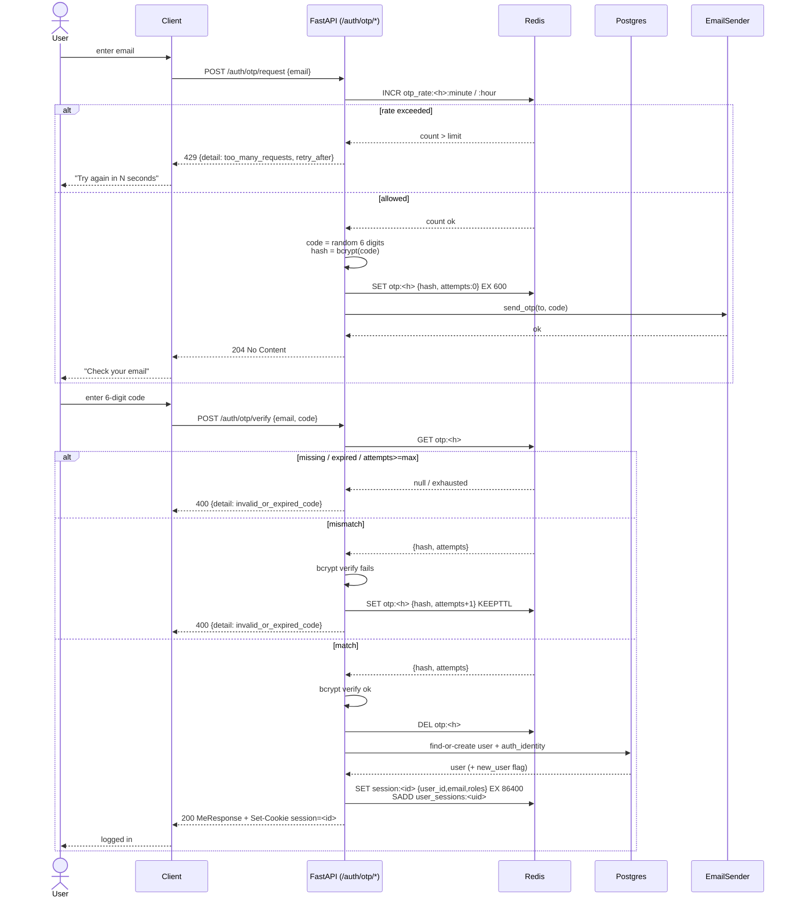

# Feature: Email OTP login — `EmailSender`, OTP endpoints, deployment docs

## Problem Statement

`feat_auth_001` laid the session rails (users/roles/identities schema, Redis
session store, `SessionMiddleware`, `GET /auth/me`, `POST /auth/logout`,
`require_roles`, `ADMIN_EMAILS` bootstrap) but shipped **no real login
path**. The only way to mint a session today is the env-gated
`POST /api/v1/_test/session` endpoint in `backend/app/auth/router.py`,
which exists solely so 001 could exercise the session plumbing
end-to-end. That endpoint is explicitly marked for removal by this
feature — per `feat_auth_001.md:9` ("ships no login paths of its own")
and `feat_auth_001.md:37` ("Removed by `feat_auth_002`").

`feat_auth_002` is the **first real login path**: email one-time-password
(OTP). A user enters their email, the backend emails a six-digit code,
the user enters the code, a session is minted. No passwords, no third
party (for the dev/test default). This is the feature that takes the
template from "has auth plumbing" to "can actually log in" without yet
needing an external OAuth configuration.

The full architectural rationale — why OTP over passwords, why bcrypt
hashing of codes, why same-response-for-known-and-unknown-emails, how
the Redis keyspaces interlock, the full security posture — lives in
**`docs/design/auth-login-and-roles.md`** (committed by 001). This spec
pulls only the slice that lands in 002. Specifically:

- §§2, 3, 4 (session, role, identity models) — already built in 001;
  002 consumes the shared helpers.
- §5.1 (module layout) — 002 fills in `app/auth/otp.py` and the
  `app/auth/email/` package.
- §6.2 (Redis keyspaces) — 002 writes `otp:<email_hash>`,
  `otp_rate:<email_hash>:minute`, `otp_rate:<email_hash>:hour`.
- §7.1 (OTP request → verify → session data flow) — verbatim contract.
- §11 (env vars) — 002 adds the `EMAIL_*` and `OTP_*` block.
- §13 (deployment docs) — 002 ships `docs/deployment/README.md` + the
  email-OTP setup guide.

## Requirements

### Functional

1. **`EmailSender` abstraction.** One-method protocol under
   `backend/app/auth/email/base.py`:

   ```python
   class EmailSender(Protocol):
       async def send_otp(self, *, to: str, code: str) -> None: ...
   ```

   Minimal by design — OTP is the only consumer in this feature. If a
   future feature needs arbitrary transactional email, the package
   hoists to `app/email/` (§5.1 of the design doc says so explicitly)
   and `send_otp` either stays as a convenience wrapper or is replaced
   with `send(...)` at that time. Not a concern for 002.

2. **`ConsoleEmailSender`** (`backend/app/auth/email/console.py`). Logs
   the OTP code through the existing `app.logging.get_logger(__name__)`
   chain — **not** `print()` and **not** raw stdout. Emits one log
   event per send:

   ```
   auth.email.console_otp_sent  email_hash=<h>  code=<code>
   ```

   The `code` field is the intentional, documented dev-only exception
   to the "never log OTP codes" rule from §10 of the design doc. The
   log event name includes `console` so an accidental production use
   of this sender surfaces loudly in log search.

3. **`ResendEmailSender`** (`backend/app/auth/email/resend.py`). Uses
   `httpx.AsyncClient` (already in the dev dependency group via
   `backend/pyproject.toml:22`, and available at runtime because
   `uvicorn[standard]>=0.30` pulls it in transitively through
   `httptools`/`watchfiles` — verify at build time with
   `uv pip show httpx`; if it is not present at runtime, promote `httpx`
   from the `dev` group to the main `dependencies` list — **no other
   new top-level Python dependency is introduced**). No Resend SDK
   package. Calls `POST https://api.resend.com/emails` with a JSON body
   of `{from, to, subject, text}`, `Authorization: Bearer <api_key>`,
   and a short timeout (5 s default, exposed as
   `EMAIL_PROVIDER_TIMEOUT_SECONDS`). On non-2xx: raise a typed
   `EmailSendError` carrying the HTTP status and (if JSON) the `message`
   field from Resend's error envelope. Never logs the API key, the
   recipient raw, or the OTP code.

4. **Provider factory** (`backend/app/auth/email/factory.py`). Exposes
   `build_email_sender(settings: Settings) -> EmailSender`. Dispatches
   on `settings.email_provider`:

   | Value | Sender | Validation |
   |---|---|---|
   | `"console"` | `ConsoleEmailSender()` | Always allowed. |
   | `"resend"` | `ResendEmailSender(api_key=..., from_=..., timeout=..., http=...)` | `RESEND_API_KEY` must be non-empty; `EMAIL_FROM` must be non-empty; otherwise raise `EmailProviderConfigError` at startup. |
   | other | — | `EmailProviderConfigError` at startup. |

   The sender is built once at app-lifespan startup and stashed on
   `app.state.email_sender`. A `get_email_sender(request) -> EmailSender`
   FastAPI dependency under `backend/app/auth/email/__init__.py` reads
   it off app state, mirroring `app.redis_client.get_redis`.

5. **OTP helpers** (`backend/app/auth/otp.py`):
   - `_email_hash(email: str) -> str` — `sha256(email.strip().lower())`
     hex, used verbatim in every Redis key the OTP flow writes.
   - `generate_code() -> str` — `f"{secrets.randbelow(10**6):06d}"`.
     Six digits. Uses `secrets.randbelow`, not `random.randrange`.
   - `hash_code(code: str) -> str` — bcrypt hash of the raw code. Work
     factor pinned at **10 rounds** (see §6.2 of the design doc for the
     "tune for ~10 ms verify" rationale — at a 1M search space, a
     higher work factor buys nothing).
   - `verify_code(code: str, hash_: str) -> bool` — constant-time
     bcrypt verify.
   - `rate_limit_keys(email: str) -> tuple[str, str]` — returns
     `(otp_rate:<h>:minute, otp_rate:<h>:hour)`.
   - `otp_key(email: str) -> str` — returns `otp:<h>`.

   **Note on `bcrypt`.** `bcrypt` is **not** currently a top-level
   dependency. It is added to `backend/pyproject.toml` under the main
   `dependencies` list as `bcrypt>=4.1`. The design doc §6.2 explicitly
   specifies bcrypt hashing. This is the one permitted new top-level
   dependency in 002 (justification: hash primitive, not avoidable via
   stdlib; `hashlib.scrypt` would work but the design doc has already
   committed to bcrypt).

6. **OTP storage helpers** (`backend/app/auth/otp_store.py` — new
   file; split from `otp.py` to keep the pure helpers above free of
   Redis I/O). All async, all take `redis: Redis`:
   - `store_otp(email: str, code_hash: str, *, redis, ttl_seconds: int) -> None`
     — `SET otp:<h> '{"code_hash":"...","attempts":0,"created_at":...}' EX <ttl>`.
   - `load_otp(email: str, *, redis) -> OtpRecord | None` — single `GET`,
     JSON-parsed, missing/malformed → `None`.
   - `increment_attempts_preserve_ttl(email: str, *, redis) -> int` —
     reads the current blob, rewrites with `attempts += 1`, preserves
     remaining TTL via `EXPIRE ... KEEPTTL` (Redis 7) or a Lua script
     that does `SET ... KEEPTTL` (safe and atomic; see §7.1 step 3 of
     the design doc — the spec there says "preserve TTL after mismatch").
     Returns the new attempt count.
   - `consume_otp(email: str, *, redis) -> None` — `DEL otp:<h>`.
   - `check_and_increment_rate(email: str, *, redis, per_minute_limit: int, per_hour_limit: int) -> RateLimitResult`
     — pipelined `INCR` on both counters plus `EXPIRE` on first increment,
     returning a `RateLimitResult(allowed: bool, retry_after: int)`
     where `retry_after` is 0 on allow and the remaining TTL of the
     offending window on deny (minute window preferred when both are
     full).

   `RateLimitResult` and `OtpRecord` are tiny frozen dataclasses in
   `app/auth/otp_store.py`; no Pydantic.

7. **`POST /api/v1/auth/otp/request`** — new route on the existing
   `app.auth.router.router` (same `APIRouter` that serves `/me` and
   `/logout`; prefix `/auth` is applied by `app.api.v1`). Request body:
   `OtpRequestIn(email: str)`. Flow (verbatim from §7.1 of the design
   doc):
   1. Validate email shape (reuse `_validate_email_shape` from
      `app.auth.schemas`; do not add a new Pydantic validator).
   2. `check_and_increment_rate(email, per_minute_limit=OTP_RATE_PER_MINUTE, per_hour_limit=OTP_RATE_PER_HOUR)`.
      On deny → return `429` with JSON body
      `{"detail": "too_many_requests", "retry_after": <seconds>}`.
      Also sets `Retry-After: <seconds>` header.
   3. `code = generate_code()`. `code_hash = hash_code(code)`.
   4. `store_otp(email, code_hash, redis=..., ttl_seconds=OTP_CODE_TTL_SECONDS)`.
   5. `await email_sender.send_otp(to=email, code=code)`.
   6. Emit log event `auth.otp.requested email_hash=<h> provider=<name>`.
   7. Respond `204 No Content`. **Same response for known and unknown
      emails** — no DB lookup on request; email-to-user resolution
      happens on verify (§7.1 "account enumeration" note).

   Email-send failures from step 5 are caught and logged as
   `auth.otp.send_failed email_hash=<h> provider=<name> reason=<code>`.
   The stored OTP remains intact so a retry without re-request is
   possible within TTL. The response is still `204` so the response
   shape stays constant regardless of provider health — the rate
   limiter ensures a user cannot weaponize this to spam Resend.

8. **`POST /api/v1/auth/otp/verify`** — new route on the same router.
   Request body: `OtpVerifyIn(email: str, code: str)`. Flow (verbatim
   from §7.1 verify steps):
   1. Validate email + code shape (code must be six digits; any non-
      match short-circuits to the same failure path as "wrong code" to
      avoid surfacing a distinct validation error).
   2. `record = load_otp(email)`. Missing → `400 invalid_or_expired_code`.
   3. `record.attempts >= OTP_MAX_ATTEMPTS` → `consume_otp(email)` then
      `400 invalid_or_expired_code`.
   4. `verify_code(code, record.code_hash)`:
      - Mismatch → `increment_attempts_preserve_ttl(email)`,
        `400 invalid_or_expired_code`.
      - Match → `consume_otp(email)` (one-shot), proceed.
   5. Find-or-create user + identity (§4 of the design doc). Helper
      lives in `app.auth.service.find_or_create_user_for_otp`:
      - Look up `(provider="email", provider_user_id=<normalized_email>)`
        in `auth_identities`; if found, `user = identity.user`.
      - Else look up `users` by email (case-insensitive via `CITEXT`);
        if found, **auto-link** — create a new `auth_identities` row
        with `provider="email"` and `provider_user_id=<normalized_email>`.
      - Else create `User(email, display_name=None)` + grant default
        `"user"` role + call
        `app.auth.bootstrap.grant_admin_if_listed(user, ...)` + create
        an `auth_identities` row with
        `provider="email", provider_user_id=<normalized_email>,
         email_at_identity=<normalized_email>`.
      - The user record's `last_login_at` column is **not** updated
        here because it does not exist on `users` today (see
        `backend/app/auth/models.py:44-63` — 001 shipped `created_at`
        and `updated_at` but not `last_login_at`, a minor deviation
        from §6.1 of the design doc that 001 did not surface). This
        feature touches **no migration**; adding `last_login_at` is
        filed as a future tracking item. `auth_identities.last_used_at`
        is also absent on 001's migration and not added here. The
        design-doc §7.1 step 6 ("`last_login_at = now()`") is therefore
        a documented no-op in 002, called out explicitly in the design
        spec's "Deviations from the design doc" section.
   6. Deactivated user (`is_active == false`): **also not applicable in 002.**
      001 did not add `is_active` to the model (see `models.py`); no
      code path can set it to false today. The design doc §7.1's
      `403 account_disabled` failure mode is therefore unreachable in
      this feature. The route still documents it in the OpenAPI
      responses, guarded by a `getattr(user, "is_active", True)` check
      so that when a later feature adds the column, the behavior comes
      online automatically.
   7. Create session (reuse `app.auth.sessions.create` — unchanged from
      001). Pass a `_UserLike(id, email, role_names)` shim for the
      same reason the test-mint route used it (avoid async lazy-load
      on `user.roles`).
   8. Set the session cookie using **exactly the same attributes** the
      test-mint set — `settings.session_cookie_name`,
      `settings.session_ttl_seconds`, `HttpOnly`, `SameSite=Lax`,
      `Path=/`, `Secure` echoed from `settings.session_cookie_secure`.
   9. Respond `200 OK` with body `MeResponse` (reuse 001's schema) —
      same shape `GET /auth/me` returns, so the frontend can treat the
      verify response interchangeably with a subsequent `/me` call.

   The four failure conditions in step 2/3/4 all return the **same
   body** `{"detail": "invalid_or_expired_code"}`, the same HTTP 400.
   Attacker cannot distinguish "never requested" from "expired" from
   "wrong code" from "attempts exhausted" — per §7.1 of the design doc.

9. **Test-only OTP-code affordance** (env + env-var gated). Needed so
   the external REST suite (`tests/tests/test_auth.py`) can drive
   request → verify without scraping logs. Rules set by the human:

   - **No hardcoded defaults in `app/settings.py`.** The two new
     settings fields are `test_otp_email: str = ""` and
     `test_otp_code: str = ""` — **empty defaults**, never populated
     from a compiled-in literal.
   - **Active only when `settings.env == "test"` AND both fields are
     non-empty.** If either condition fails, the affordance is a no-op
     — identical to production behavior.
   - **Mechanism:** inside `POST /auth/otp/request`, after step 4
     (stored real OTP) and **before** step 5 (send email), if the
     affordance is active and the normalized request email matches
     `settings.test_otp_email` (case-insensitive), **overwrite** the
     stored `code_hash` with `hash_code(settings.test_otp_code)`. The
     real code is still generated and still sent (so the console path
     continues to log a decoy), but verify will succeed only for the
     test code. Overwrite happens via the same `store_otp` call
     (replacing the record; TTL resets to the configured value).
   - **No behavior change on verify.** Verify reads whatever hash is
     in Redis — no branching. The gating lives entirely in request.
   - **No behavior change on rate-limit.** The test affordance does
     not bypass rate limits; tests must space calls or reset
     `otp_rate:*` keys via a test fixture.

   The env-var names are `TEST_OTP_EMAIL` and `TEST_OTP_CODE`, matching
   the `SESSION_COOKIE_*` / `ADMIN_EMAILS` style (upper-snake with the
   feature-area prefix). New env-var rows in `infra/.env.example` sit
   under a dedicated `# ---- Test-only OTP fixture (feat_auth_002) ----`
   heading with both values **empty** and a multi-line comment block
   explaining they must stay empty outside of the test environment.

10. **Remove the test-only session-mint endpoint.** `test_router` and
    `mint_test_session` in `backend/app/auth/router.py` (currently lines
    114–175), their conditional mount in `backend/app/main.py`
    (currently lines 107–114), and the `TestSessionRequest` schema in
    `backend/app/auth/schemas.py` (currently lines 69–88, including the
    import-level `field_validator` it pulled in) are **deleted**. The
    corresponding test file `backend/tests/test_auth_test_mint_gating.py`
    is deleted. The other 001 tests that rely on the mint endpoint
    (`test_auth_middleware.py`, `test_auth_me_logout.py`) are rewritten
    to mint sessions via `POST /api/v1/auth/otp/request` +
    `POST /api/v1/auth/otp/verify` with the test-OTP affordance set up
    by the test fixture. `test_auth_bootstrap.py`, `test_auth_dependencies.py`,
    and `test_auth_sessions.py` do not use the mint endpoint and are
    unchanged.

    `app.auth.service.find_or_create_user_for_test` (currently defined
    in `backend/app/auth/service.py`, referenced by
    `design_auth_001.md:44` and exported at `service.py:195`) is
    deleted alongside — the new `find_or_create_user_for_otp` replaces
    it, and no test should synthesize users behind the router anymore.

11. **New settings fields** (`backend/app/settings.py`), added under a
    new `# ---- Email / OTP (feat_auth_002) ----` header block:

    ```python
    email_provider: Literal["console", "resend"] = "console"
    email_from: str = "minimalist-app <noreply@example.com>"
    email_provider_timeout_seconds: float = 5.0
    resend_api_key: str = ""

    otp_code_ttl_seconds: int = 600
    otp_max_attempts: int = 5
    otp_rate_per_minute: int = 1
    otp_rate_per_hour: int = 10

    # Test-only OTP fixture (see feat_auth_002 spec requirement 9).
    # Intentionally has NO compiled-in default value; populated from env
    # ONLY in the test environment. Must stay empty in dev/prod.
    test_otp_email: str = ""
    test_otp_code: str = ""
    ```

    All values use the exact numeric defaults the design doc §11
    specifies. `test_otp_email` / `test_otp_code` additionally carry a
    runtime guard: `app.auth.email.factory.build_email_sender` raises
    `EmailProviderConfigError` at startup when
    `settings.env != "test"` and either `test_otp_email` or
    `test_otp_code` is non-empty — defense-in-depth against a
    production .env that accidentally sets them.

12. **New `.env.example` block** (`infra/.env.example`). Appended after
    the existing auth block:

    ```ini
    # ---- Email / OTP (feat_auth_002) ---------------------------------------
    # Controls how OTP codes are delivered. The `console` provider logs the
    # code through the backend's structlog chain (visible via
    # `docker compose logs backend | grep auth.email.console_otp_sent`).
    # Switch to `resend` and populate RESEND_API_KEY in staging/prod — see
    # docs/deployment/email-otp-setup.md.
    EMAIL_PROVIDER=console
    EMAIL_FROM=minimalist-app <noreply@example.com>
    EMAIL_PROVIDER_TIMEOUT_SECONDS=5
    RESEND_API_KEY=

    OTP_CODE_TTL_SECONDS=600
    OTP_MAX_ATTEMPTS=5
    OTP_RATE_PER_MINUTE=1
    OTP_RATE_PER_HOUR=10

    # ---- Test-only OTP fixture (feat_auth_002) -----------------------------
    # INTENTIONALLY EMPTY. Populate ONLY in the ENV=test environment.
    # When both are set AND ENV=test, POST /auth/otp/request will make the
    # verify code for TEST_OTP_EMAIL equal to TEST_OTP_CODE (rate-limit still
    # applies). See docs/specs/feat_auth_002/feat_auth_002.md requirement 9.
    # The backend refuses to start with these set when ENV != "test".
    TEST_OTP_EMAIL=
    TEST_OTP_CODE=
    ```

13. **Deployment documentation** (`docs/deployment/` — **new directory**,
    per `conventions.md:120` this path is distinct from top-level
    `deployment/` which is reserved for Helm/Terraform).

    Two files ship in 002:

    - **`docs/deployment/README.md`** — the landing-page index. One-
      screen content per §13 of the design doc:

      > External services that need manual setup before production.
      > Each guide is self-contained and lists the env vars it populates.
      >
      > - [Email / OTP](email-otp-setup.md) — required for `feat_auth_002`
      >   in non-dev environments (Sign in with email OTP).
      > - *(Google OAuth — added by `feat_auth_003`.)*

    - **`docs/deployment/email-otp-setup.md`** — the operator guide.
      Structure per §13 of the design doc:
      1. Provider comparison table (Resend / SendGrid / SES / Postmark —
         four rows × four columns: **Price tier**, **Setup effort**,
         **Free-tier ceiling**, **Primary region**).
      2. Why the template defaults to Resend (simplest API, free tier).
      3. **Dev login flow.** Explicit section: with the default
         `EMAIL_PROVIDER=console`, the code is logged, not emailed.
         Show the exact command to extract it:

         ```bash
         docker compose logs backend | grep auth.email.console_otp_sent | tail -n 1
         ```

         Plus the structlog-JSON field to grep
         (`\"code\":\"123456\"`). This is the dev-mode login story the
         human called out in clarifying answer 2.
      4. Step 1: Create Resend account.
      5. Step 2: Verify sending domain (DKIM + SPF DNS records). Call
         out the 24 h DNS-propagation reality.
      6. Step 3: Generate API key, note the scopes (sending only).
      7. Step 4: Populate `.env` — `EMAIL_PROVIDER=resend`,
         `RESEND_API_KEY=...`, `EMAIL_FROM="..."`.
      8. Step 5: Verify — `make up`, POST `/api/v1/auth/otp/request`,
         confirm email lands, check DKIM pass in headers.
      9. Troubleshooting table: email in spam; DKIM fail;
         sender-not-verified; Resend rate limit; switching to SendGrid.
      10. Rotating credentials.
      11. **Test-OTP fixture reminder.** Brief call-out reminding the
          operator that `TEST_OTP_EMAIL` / `TEST_OTP_CODE` must stay
          empty in non-test environments and that the backend refuses
          to start otherwise (§11's startup guard).

14. **Tracking rows.** `docs/tracking/features.md` gains a new row for
    `feat_auth_002` with `Status=Specced`, Spec-PR and Issues
    backfilled per Atlas's Step 4 / Step 5. `docs/specs/README.md`
    roster table gains the same row.

15. **Observability — log event vocabulary** (per §10 of the design
    doc, §9.1 of this spec). Emit exactly the following events, no
    more, no fewer:

    | Event | Fields | Emitted by |
    |---|---|---|
    | `auth.otp.requested` | `email_hash`, `provider`, `rate_bucket_minute`, `rate_bucket_hour` | `/otp/request` happy path |
    | `auth.otp.rate_limited` | `email_hash`, `retry_after`, `window` (`"minute"` or `"hour"`) | `/otp/request` deny |
    | `auth.otp.send_failed` | `email_hash`, `provider`, `reason`, `http_status` (Resend only) | `/otp/request` step 5 error |
    | `auth.email.console_otp_sent` | `email_hash`, `code` | `ConsoleEmailSender.send_otp` |
    | `auth.otp.verified` | `user_id`, `email_hash`, `new_user` (bool) | `/otp/verify` happy path |
    | `auth.otp.failed` | `email_hash`, `reason` ∈ `{missing,expired,wrong_code,attempts_exhausted}`, `attempts` | `/otp/verify` fail |
    | `auth.session.created` | `user_id`, `session_id_hash` | verify happy path (reuses the helper from 001) |

    `email_hash` and `session_id_hash` are the 16-char truncated
    SHA-256 shapes already defined in `backend/app/middleware.py:186-194`
    (the `_session_id_hash` pattern). OTP code is **never** logged
    except in the `console_otp_sent` event (intentional dev-only
    exception, called out in §10 of the design doc).

### Non-functional

16. **Python dependencies.** Exactly one new top-level addition:
    `bcrypt>=4.1` in `backend/pyproject.toml` `[project] dependencies`.
    `httpx` may be promoted from the `[dependency-groups] dev` list to
    the main `dependencies` list if the build-time `uv pip show httpx`
    check (requirement 3) shows it is not transitively available at
    runtime; prefer promotion over adding the Resend SDK. **No Resend
    SDK package is added.** No other additions.

17. **No frontend changes.** The login UI is `feat_frontend_002`.
    `frontend/` is untouched in this feature.

18. **No schema changes.** No new Alembic migration. Every `users` /
    `roles` / `user_roles` / `auth_identities` touch reuses the 001
    schema exactly. The `last_login_at` / `last_used_at` /
    `is_active` columns that the design doc §6.1 mentions but 001
    did not implement stay absent; closing that gap is a future
    backend-tracking ticket, filed outside this feature.

19. **No DB hit on `/auth/me` or in `SessionMiddleware`.** The
    invariant 001 established is preserved. OTP verify performs DB
    writes (user + identity + role), which is expected — this is the
    login path. `/otp/request` performs **zero DB writes** (by design:
    keeps account enumeration impossible).

20. **Backward-compatible with 001's external surface.**
    `GET /api/v1/auth/me`, `POST /api/v1/auth/logout`, `/api/v1/hello`,
    `/healthz`, `/readyz` are untouched in routing, behavior, and
    response shape. The test-only mint at `POST /api/v1/_test/session`
    is removed — any caller still hitting it gets `404 Not Found`
    regardless of `env`.

21. **Keeps `test.sh` passing.** The external suite under `tests/tests/`
    continues to hit the live compose backend. Two new scenarios are
    added (happy-path OTP request + verify using the test-OTP
    affordance configured in a dedicated `tests/tests/conftest.py`
    overlay); the existing `test_auth.py` assertions for unauthenticated
    `/auth/me` + `/auth/logout` stay green.

22. **No linting, formatting, or pre-commit tooling** (per
    `conventions.md` §11).

## User Stories

- As **Vulcan** (builder of this feature), I want the session-creation
  helper, `AuthContext` schema, `SessionMiddleware`, `current_user`
  dependency, `ADMIN_EMAILS` bootstrap, and `auth_identities` table to
  already exist, so OTP verify is purely a code-gen-and-check +
  find-or-create + reuse-existing-helpers feature with no new
  infrastructure.
- As a **human developer on a fresh clone**, I want `make up && make test`
  to keep passing with the default `.env.example`. The backend must not
  require a Resend account — `EMAIL_PROVIDER=console` + "grep the
  backend log for the code" is the documented dev login flow.
- As a **human operator preparing for production**, I want one guide —
  `docs/deployment/email-otp-setup.md` — that gets me from zero to a
  working Resend integration, including the DKIM/SPF story, and one
  landing page — `docs/deployment/README.md` — that tells me which
  other external services a given feature requires.
- As a **test author for the external REST suite**, I want a way to
  drive `/otp/request` → `/otp/verify` deterministically without
  scraping docker logs. The `TEST_OTP_EMAIL` / `TEST_OTP_CODE` env-gated
  affordance gives me exactly one well-scoped injection point.
- As a **security reviewer**, I want OTP codes to be bcrypt-hashed at
  rest in Redis, rate-limited per email, one-shot on success,
  bounded-attempts on failure, and indistinguishable across the four
  bad-code conditions in the response body. All of §§7.1 + 8 of the
  design doc is verifiable end-to-end from the test spec.

## User Flow

The OTP login flow is the user-facing contract; a sequence diagram is
warranted (per the `## User Flow` template — this is a multi-step user-
facing flow with response-shape branching).



## Scope

### In Scope

- `backend/app/auth/otp.py` — code generation, hashing, key helpers.
- `backend/app/auth/otp_store.py` — Redis I/O for OTP and rate limit.
- `backend/app/auth/email/__init__.py`, `base.py`, `console.py`,
  `resend.py`, `factory.py`.
- `backend/app/auth/schemas.py` — new `OtpRequestIn`, `OtpVerifyIn`
  classes; **deletion** of `TestSessionRequest`.
- `backend/app/auth/router.py` — two new route handlers
  (`request_otp`, `verify_otp`); **deletion** of `test_router` and
  `mint_test_session`.
- `backend/app/auth/service.py` — new `find_or_create_user_for_otp`;
  **deletion** of `find_or_create_user_for_test`.
- `backend/app/main.py` — `app.state.email_sender` built at lifespan
  startup; **deletion** of the env-gated `test_router` mount block.
- `backend/app/settings.py` — new fields per requirement 11; startup
  guard on `TEST_OTP_*`.
- `backend/pyproject.toml` — `bcrypt>=4.1` added; `httpx` promoted to
  main deps if the runtime check in requirement 3 shows it is not
  transitively present.
- `infra/.env.example` — new blocks per requirement 12.
- `backend/tests/` — new tests per `test_auth_002.md`; **rewrite** of
  `test_auth_middleware.py` and `test_auth_me_logout.py` to drive
  sessions via OTP; **deletion** of `test_auth_test_mint_gating.py`.
- `tests/tests/conftest.py` — overlay that configures `TEST_OTP_*` and
  provides fixtures for new external scenarios.
- `tests/tests/test_auth.py` — two new scenarios using the test-OTP
  fixture.
- `docs/deployment/README.md`, `docs/deployment/email-otp-setup.md`.
- `docs/specs/feat_auth_002/{feat,design,test}_auth_002.md`.
- `docs/specs/README.md`, `docs/tracking/features.md` — tracking rows.

### Out of Scope

- `GET /auth/google/start`, `GET /auth/google/callback`, `app/auth/google.py`,
  JWKS verification, PKCE helpers — `feat_auth_003`.
- `docs/deployment/google-oauth-setup.md` — `feat_auth_003`.
- Any frontend work (login page, `AuthContext`, protected-route
  wrapper, "signed in as" header) — `feat_frontend_002`.
- Schema changes: `last_login_at`, `last_used_at`, `is_active`. Filed
  outside this feature; not a blocker for OTP.
- Account linking UI, email templating system, password reset, MFA/
  TOTP, admin dashboard, account self-deletion (non-goals per §15 of
  the design doc).
- Custom email HTML templates. The OTP body is a string literal (§15
  of the design doc).
- Resend webhooks (bounce / complaint handling). Future ops concern.
- Provider auto-fallback (`resend → sendgrid`). Single provider at a
  time; switching is an ops-side env-var flip.

## Acceptance Criteria

- [ ] `backend/app/auth/email/base.py` exposes an `EmailSender` Protocol
      with `async send_otp(*, to: str, code: str) -> None`. `console.py`
      and `resend.py` both conform to it (verifiable via
      `typing.runtime_checkable` + a `@pytest.mark.parametrize` fixture
      over both implementations).
- [ ] `ConsoleEmailSender.send_otp` emits exactly one log event
      `auth.email.console_otp_sent` with fields `email_hash` and `code`,
      using `app.logging.get_logger(__name__)`. No `print()` calls.
- [ ] `ResendEmailSender.send_otp` POSTs to
      `https://api.resend.com/emails` with a JSON body containing `from`,
      `to`, `subject`, `text`; with `Authorization: Bearer <api_key>`;
      with a configurable timeout. On a mocked non-2xx response it
      raises `EmailSendError` carrying the HTTP status.
- [ ] `build_email_sender(Settings(email_provider="resend", resend_api_key="", ...))`
      raises `EmailProviderConfigError`. With `resend_api_key` set it
      returns a `ResendEmailSender` instance.
- [ ] `build_email_sender(Settings(env="dev", test_otp_email="x", test_otp_code="y", ...))`
      raises `EmailProviderConfigError` at startup. With `env="test"`
      and both set, it returns the configured provider and the
      test-OTP overwrite path is active.
- [ ] `otp.generate_code()` returns a 6-character all-digits string
      over 10 000 samples. `otp.hash_code(code)` + `otp.verify_code(code, hash_)`
      round-trips to `True`. `verify_code("999999", hash_of("000000"))`
      is `False` with no timing spike detectable in the test harness.
- [ ] `store_otp` + `load_otp` round-trip a record. Malformed JSON in
      the Redis value → `load_otp` returns `None`.
- [ ] `increment_attempts_preserve_ttl` increments `attempts` in the
      stored record and leaves the key's remaining TTL within ±1 s of
      its value before the call.
- [ ] `check_and_increment_rate` returns `allowed=True` on the first
      call, `allowed=False` with `retry_after ∈ [1, 60]` on the second
      call within a minute when `per_minute_limit=1`. After the minute
      TTL expires, the next call is `allowed=True` again.
- [ ] `POST /api/v1/auth/otp/request` with a valid `{email}` returns
      `204` and causes one `auth.otp.requested` log event. A second
      call within 60 s returns `429` with body
      `{"detail": "too_many_requests", "retry_after": <int>}` and a
      `Retry-After` header.
- [ ] `POST /api/v1/auth/otp/request` for **any** email (known or
      unknown) returns the same `204` body and emits the same
      `auth.otp.requested` event shape.
- [ ] `POST /api/v1/auth/otp/request` with `EMAIL_PROVIDER=resend` and
      the Resend endpoint mocked to return `500` still returns `204`,
      emits `auth.otp.send_failed`, and leaves the stored OTP in Redis.
- [ ] `POST /api/v1/auth/otp/verify` with the code minted by the
      preceding request returns `200`, sets `Set-Cookie` with
      `HttpOnly; Path=/; SameSite=Lax; Max-Age=86400` (plus `Secure`
      when `SESSION_COOKIE_SECURE=true`), and returns a `MeResponse`
      with `user_id`, `email`, `roles: ["user"]`. A follow-up
      `GET /api/v1/auth/me` with the cookie returns the same payload.
- [ ] `/auth/otp/verify` with a wrong code returns `400` body
      `{"detail": "invalid_or_expired_code"}`. `attempts` in Redis
      increments. A sixth wrong attempt returns the same 400; the
      Redis key is deleted.
- [ ] `/auth/otp/verify` with a never-requested email returns `400`
      body `{"detail": "invalid_or_expired_code"}` — **same body** as
      wrong code.
- [ ] `/auth/otp/verify` twice with the same valid code: the second
      call returns `400` `invalid_or_expired_code` (one-shot).
- [ ] `ADMIN_EMAILS=alice@x.com` + OTP login for `alice@x.com` grants
      both `user` and `admin`. `GET /auth/me` after verify shows both
      roles.
- [ ] A pre-existing user created by a hypothetical earlier
      registration path (in the test suite, synthesized via a direct
      SQL insert): first OTP login for that email **auto-links** a new
      `auth_identities` row with `provider="email"` and reuses the
      existing user; no duplicate `users` row.
- [ ] `TEST_OTP_EMAIL=alice@x.com`, `TEST_OTP_CODE=123456`, `ENV=test`
      → `/auth/otp/request` for `alice@x.com` stores
      `hash_code("123456")`. `/auth/otp/verify` with `code="123456"`
      succeeds. For any other email, the affordance is inactive and
      the real generated code is what's stored.
- [ ] Same settings with `ENV=dev` → backend refuses to start with
      `EmailProviderConfigError`.
- [ ] With `TEST_OTP_EMAIL=""` and `TEST_OTP_CODE=""` (defaults), the
      affordance is inactive in `ENV=test` as well — behavior matches
      production.
- [ ] `POST /api/v1/_test/session` returns `404` under `ENV=test`
      (endpoint deleted). `app.auth.service.find_or_create_user_for_test`
      is not importable (symbol deleted). `TestSessionRequest` is not
      importable (symbol deleted).
- [ ] `backend/app/auth/router.py` no longer references `test_router`.
      `backend/app/main.py` no longer contains the `if resolved.env == "test":
      ... include_router(test_router, ...)` block.
- [ ] `docs/deployment/README.md` exists with the index content from
      requirement 13. `docs/deployment/email-otp-setup.md` exists
      with the sections listed in requirement 13, including the dev-
      flow `docker compose logs` snippet and the troubleshooting
      table.
- [ ] `infra/.env.example` contains the two new blocks under the
      correct headings with the defaults from requirement 12. The
      `TEST_OTP_*` block is immediately followed by the intentionally-
      empty comment block.
- [ ] `docs/tracking/features.md` contains a row for `feat_auth_002`
      whose status advances `Specced` → `Ready` on merge. `docs/specs/README.md`
      roster gains a matching row.
- [ ] `uv run pytest` from `backend/` with `ENV=test` passes. Every
      new test named in `test_auth_002.md` runs; the rewritten
      `test_auth_middleware.py` / `test_auth_me_logout.py` continue to
      pass using the OTP-minted sessions.
- [ ] `test.sh` continues to pass, including the two new external
      scenarios (requirement 21).

## Follow-on features

This spec treats the following as open, **not** committed, ordering for
the remainder of the four-feature auth sequence. Confirmed before 002
merges:

- `feat_auth_003` — Google OAuth.
- `feat_frontend_002` — Login UI.

Default ordering (`002 → frontend_002 → 003`) is Atlas's working
assumption per the human's note on clarifying question 1; it will be
reconfirmed when 002 is close to merging.
