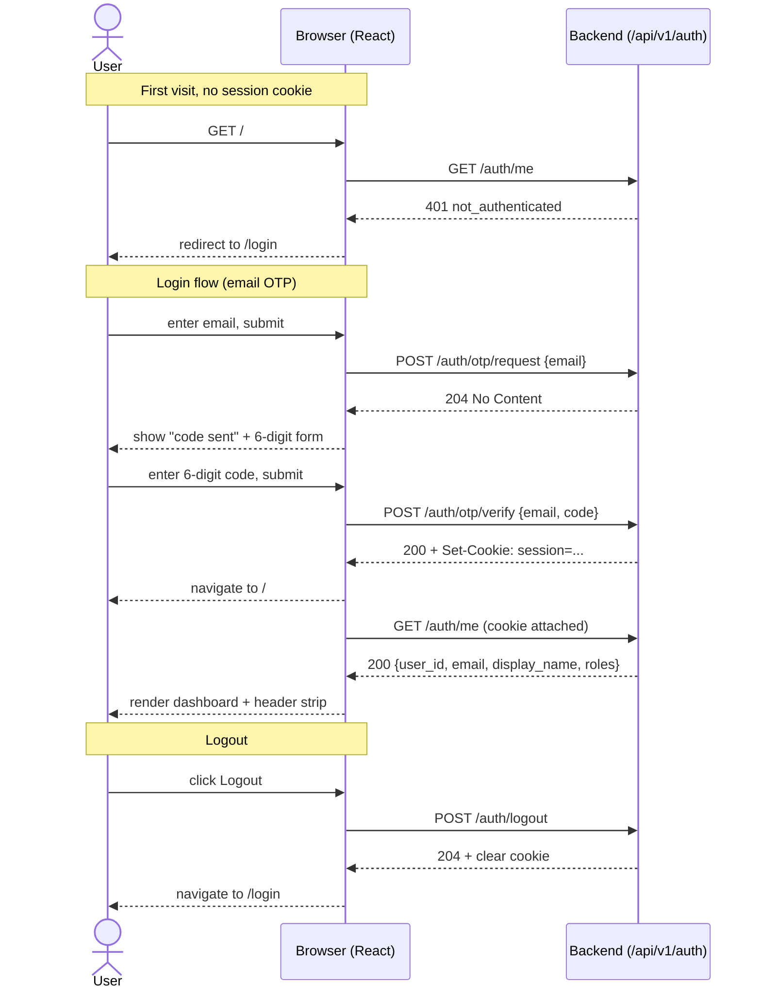

# Feature: Login UI — AuthContext, `/login` page, dashboard, and Playwright e2e

## Problem Statement

The backend ships an end-to-end authentication flow today: `feat_auth_001`
provides sessions, `/api/v1/auth/me`, and `/api/v1/auth/logout`, and
`feat_auth_002` adds the two OTP endpoints (`/api/v1/auth/otp/request`,
`/api/v1/auth/otp/verify`) together with the env-gated
`TEST_OTP_EMAIL` / `TEST_OTP_CODE` fixture. On the frontend, however,
`feat_frontend_001` only renders a single hello-world page — there is no
way for a user to sign in through the browser, no notion of an
authenticated session in the UI, and no test that exercises the OTP flow
end-to-end against a real browser.

This feature adds the smallest possible **login UI** over the already-
shipping OTP backend, plus a minimal authenticated landing page and a
Playwright e2e test that drives the whole round trip through a browser.
It deliberately does not expand backend surface area — it only consumes
what `feat_auth_001` and `feat_auth_002` already exposed.

## Requirements

- A `/login` route renders a two-step email-OTP form:
  1. Step 1 (request): the user enters their email. Submitting calls
     `POST /api/v1/auth/otp/request` and advances to step 2 on 204 (or on
     any response that indicates the request was accepted).
  2. Step 2 (verify): the user enters a six-digit code. Submitting calls
     `POST /api/v1/auth/otp/verify` and, on 200, navigates to `/`.
- The `/login` page also renders a **disabled "Sign in with Google"
  button** labeled "coming soon" (tooltip or adjacent text). It must not
  call any backend endpoint and must not reference any route that does
  not yet exist. `feat_auth_003` will wire it up.
- Unauthenticated visits to `/` redirect to `/login`. Authenticated
  visits to `/` render a **dashboard** page with a persistent header
  strip (signed-in email + roles + logout button) and the dashboard
  content below.
- The dashboard body shows:
  - A greeting line (`Welcome, <display_name or email>`).
  - The list of roles from `GET /api/v1/auth/me`.
  - The existing `getHello()` widget from `feat_frontend_001`, folded
    into a small panel so the Postgres + Redis demo the project ships
    with stays exercised.
- An **`AuthContext`** provides the current-user state to the app. On
  mount it calls `GET /api/v1/auth/me`. A 200 stashes the response; a
  401 routes the user to `/login`; a loading skeleton renders during the
  in-flight request. A 401 is **not** rendered as an error state — it
  is interpreted as "anonymous user, go to `/login`".
- The logout button calls `POST /api/v1/auth/logout`, clears the
  in-memory `AuthContext`, and navigates to `/login`.
- All new API calls use **relative URLs** via the same-origin pattern
  established by `frontend/src/api/client.ts`. The `HttpOnly; SameSite=Lax`
  session cookie set by `/otp/verify` is therefore sent automatically on
  subsequent `/auth/me` and `/auth/logout` calls without any
  `credentials: 'include'` fetch option.
- Routing uses `react-router-dom@7` as a new dependency.
- A **Playwright e2e test** under `frontend/tests/e2e/` drives the full
  login flow in a browser against the compose stack, using the
  `TEST_OTP_EMAIL` / `TEST_OTP_CODE` fixture (no log scraping). It is
  **not** part of the default `./test.sh` path.
- `@playwright/test` is added as a frontend **dev dependency** only.
  Browser binaries are installed per-machine via `bunx playwright install`.
- `frontend/README.md` (and `docs/deployment/` if a separate operator
  page is warranted) documents how to run Playwright and how to set
  `TEST_OTP_EMAIL` / `TEST_OTP_CODE` in `infra/.env` before `make up`.
- **No backend changes.** The backend exposes exactly what this UI
  needs today.

## User Stories

- As a user clicking into the site for the first time, I want to hit
  `/` and be taken to a login page, so I always know how to authenticate.
- As a returning user with a live session cookie, I want `/` to render
  the dashboard directly without a login round-trip, so the app does
  not force me to sign in twice.
- As a user signing in, I want to enter my email, receive a six-digit
  code, enter the code, and land on the dashboard, so the whole flow
  takes one minute.
- As a user who typed the wrong code, I want a clear error on the code
  form with the ability to retry (or go back and request a new code),
  so a typo does not force me to restart.
- As a user curious about Google sign-in, I want to see the Google
  button visibly rendered but clearly marked "coming soon", so I know
  the provider is on the roadmap.
- As a signed-in user, I want a logout button in the header of every
  authed page so I can end my session without hunting for it.
- As a developer running `make up` locally, I want a Playwright test
  I can run with a single command that covers the full login flow
  against the running stack, so login regressions get caught before a
  PR lands.

## User Flow

## Scope

### In Scope

- New route layer using `react-router-dom@7` with at least:
  `/` (authed dashboard), `/login` (public), and an implicit redirect
  for unauthed `/` to `/login`.
- New `AuthContext` that bootstraps from `GET /auth/me` and exposes
  `{ user, status, refresh, logout }` to descendants.
- New `/login` page with a two-step email-OTP form and a disabled
  "Sign in with Google (coming soon)" button.
- New `Dashboard` page reusing the existing `getHello()` call as a
  panel, plus a greeting + role list.
- New persistent **header strip** component rendered on all authed
  routes: signed-in email, role chips, logout button.
- Auth API client additions (either `frontend/src/api/client.ts`
  extensions or a sibling `frontend/src/api/auth.ts` — Vulcan picks
  per existing convention). All calls use relative URLs.
- Minimal CSS for the login form, header strip, and dashboard layout,
  in the same default-styled Vite idiom the hello page already uses
  (no design-system dependency).
- `@playwright/test` as a **dev dependency** in `frontend/package.json`.
- `frontend/tests/e2e/` directory with at least a `login.spec.ts` that
  drives `/login` -> OTP request -> OTP verify -> dashboard -> logout
  using the `TEST_OTP_EMAIL` / `TEST_OTP_CODE` fixture against a
  running compose stack. The test reads those env vars from the
  Playwright runner (not from the UI).
- `frontend/playwright.config.ts` pointing `baseURL` at the
  Vite-served frontend origin (default `http://localhost:5173`).
- `frontend/README.md` additions: how to install browsers
  (`bunx playwright install`), how to run the e2e suite
  (`bun run test:e2e`), how to set `TEST_OTP_EMAIL` /
  `TEST_OTP_CODE` in `infra/.env` before `make up`.
- A short operator note in `docs/deployment/` (file name chosen by
  Vulcan — either a new `docs/deployment/frontend-e2e.md` or a
  subsection appended to the existing `docs/deployment/email-otp-setup.md`
  covering the `TEST_OTP_*` fixture pair, since that fixture is what
  the e2e suite consumes).

### Out of Scope

- Backend changes of any kind (routes, schemas, settings). If Vulcan
  finds it needs a backend edit, stop and escalate — it means a spec
  boundary was drawn wrong.
- Google OAuth — the button is a visible "coming soon" placeholder.
  Wiring it to a real backend route is `feat_auth_003`.
- UI component libraries, design systems, Tailwind, shadcn, MUI, etc.
- State-management libraries (Redux, Zustand, Jotai, React Query,
  SWR). Plain `useState` / `useEffect` plus the `AuthContext` suffice
  for the surface area in this feature.
- Unit / component / Vitest tests. The only test harness added is
  Playwright e2e, per the user's explicit decision.
- Adding Playwright to the default `./test.sh` path. It runs as a
  separate invocation, mirroring how the external REST suite under
  `tests/` is invoked.
- Profile editing, password management, account deletion, session-
  management UI beyond the logout button.
- Server-side rendering, static pre-rendering, or any non-Vite build
  path.
- CI wiring (GitHub Actions) for Playwright. The test is runnable
  locally in this feature; CI hookup is deferred.
- Error-boundary / toast-notification infrastructure beyond
  per-form inline errors.
- i18n or accessibility beyond the baseline (visible focus, labelled
  inputs, `aria-live` for the OTP "code sent" message).

## Acceptance Criteria

- [ ] Visiting `/` with no session cookie redirects to `/login` and
      the URL bar shows `/login` (not `/`).
- [ ] Visiting `/login` renders the email form and a disabled Google
      button labeled "coming soon".
- [ ] Submitting a valid email to step 1 calls
      `POST /api/v1/auth/otp/request` exactly once and advances the UI
      to the code-entry step.
- [ ] Submitting a valid code to step 2 calls
      `POST /api/v1/auth/otp/verify` exactly once, receives a 200, and
      navigates to `/`.
- [ ] After step 2 succeeds, `/` renders the header strip (email +
      roles + logout) and the dashboard body (greeting + roles + hello
      panel).
- [ ] Clicking the Google button performs no network call.
- [ ] The logout button calls `POST /api/v1/auth/logout`, clears the
      in-memory auth state, and navigates back to `/login`.
- [ ] A refresh of any authed route with a live cookie still renders
      the authed UI (not the login form), because `AuthContext` re-
      bootstraps from `/auth/me`.
- [ ] A refresh of any authed route after the cookie expires (or after
      logout) redirects to `/login`.
- [ ] No new API call in the frontend uses an absolute URL or the
      `credentials: 'include'` option. All auth calls are relative
      like the existing `getHello()`.
- [ ] `bun run build` passes with zero TypeScript errors.
- [ ] `@playwright/test` appears only under `devDependencies` in
      `frontend/package.json`.
- [ ] `frontend/tests/e2e/login.spec.ts` exists and asserts: landing
      redirect, OTP request, OTP verify, dashboard render,
      `/auth/me` data visible in the DOM, successful logout.
- [ ] The Playwright spec reads `TEST_OTP_EMAIL` / `TEST_OTP_CODE`
      from the runner env and `skip`s (not fails) when either is unset
      — mirroring the behavior in `tests/tests/test_auth.py`.
- [ ] `frontend/README.md` documents `bunx playwright install` and
      `bun run test:e2e`, and links to the operator note on
      `TEST_OTP_*` wiring.
- [ ] `./test.sh` remains unchanged in behavior — running it does not
      invoke Playwright.
- [ ] No file under `backend/` is modified by this feature.
