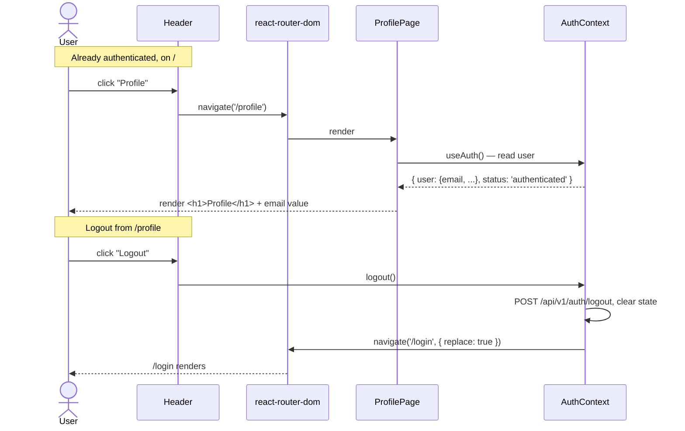

# Feature: Profile page — `/profile` route, header Profile button, email-only view

## Problem Statement

`feat_frontend_002` landed the auth shell: `AuthProvider` bootstraps from
`GET /api/v1/auth/me`, `<RequireAuth>` gates the dashboard, and
`<Header>` renders the signed-in email, role chips, and a logout button
on every authed route. The current authed surface is exactly **one
route** (`/`, the dashboard). There is no dedicated place to surface
identity-shaped information — even though the backend already returns
the user's email on `/auth/me` — and there is no second authed route to
prove the routing shell is generalisable.

This feature adds the smallest possible **profile page** on top of that
shell. It introduces a second authed route (`/profile`), wires a plain-
text **Profile** button as the leftmost element of `<Header>` so it is
reachable from every authed page, and renders the user's email on the
page body. Logout remains in `<Header>` (so it is still one click away
from `/profile` without needing a duplicate logout button on the page
itself). No backend changes; the page consumes the same `Me` payload the
`AuthContext` already holds.

## Requirements

- A new authed route at `/profile` renders a minimal profile page that
  shows the signed-in user's email.
- `<Header>` gains a **Profile** button as its **leftmost** element. The
  button is plain text (no avatar, no icon, no styling beyond what the
  existing `<Header>` already uses for `Logout`). It navigates to
  `/profile` via `react-router-dom`'s client-side routing — it does not
  reload the page.
- The Profile button is rendered on **every authed page**, including
  `/profile` itself. On `/profile` the button stays active (clickable,
  no disabled state); clicking it on the profile page is a no-op-shaped
  re-navigation to the same URL — acceptable.
- The profile page body shows **only the email value**. No `Email:`
  label is added in front of the value. A page-level `<h1>Profile</h1>`
  heading is permitted (and recommended) for accessibility / page-title
  semantics; no other body text is added.
- While `AuthContext.status === 'loading'` the profile page renders a
  visible loading placeholder (plain text — `Loading…` or equivalent —
  no spinner library, matching the bland Vite default styling already
  used elsewhere). In practice `<RequireAuth>` already handles the
  bootstrap case, so this loading state covers any in-page reload of
  the auth state (e.g. after a future `refresh()` call) rather than
  the first-mount bootstrap.
- `<Header>` continues to render the existing email + role chips +
  logout. The existing element ordering is preserved **except** that
  Profile is prepended at position 0. Logout stays at the rightmost
  slot.
- Logout from `/profile` works exactly as it does from `/`: clicking
  `Logout` in `<Header>` calls `POST /api/v1/auth/logout`, clears
  in-memory auth state, and navigates to `/login`.
- Navigating to `/profile` while unauthenticated routes the user to
  `/login` via the existing `<RequireAuth>` gate (no new redirect logic
  is introduced).
- After successful login the user lands on `/` (the dashboard) — the
  default landing page is unchanged. `/profile` is reachable only by
  clicking the new header button or by direct URL.
- All new client-side calls — if any — use **relative URLs** and the
  same-origin invariant established in `feat_frontend_002`. In practice
  this feature adds zero new API calls; the email is read from the
  existing `AuthContext.user.email`.
- A new **Playwright e2e spec** at `frontend/tests/e2e/profile.spec.ts`
  drives `/profile` end-to-end against the compose stack: log in via
  the OTP fixture, click the header Profile button, assert the URL,
  assert the email is visible on the page body, click Profile a second
  time on `/profile` (no-op), click Logout, assert redirect to `/login`.
  It uses the same `getOtpFixture()` skip pattern as `login.spec.ts`.
- No changes to `backend/`, `infra/`, or `tests/` (the REST suite).
  `./test.sh` remains unchanged in behavior.

## User Stories

- As a signed-in user, I want a Profile button visible in the header on
  every authed page so I can reach my profile from anywhere in one click.
- As a signed-in user, I want the Profile button to be the leftmost
  element of the header so its placement matches the convention used in
  most web apps.
- As a signed-in user, I want the profile page to show my account email
  so I can verify which account I am currently signed in with.
- As a signed-in user, I want logout to remain reachable from the
  profile page (via the same header strip) so I can sign out without
  navigating back to the dashboard first.
- As an unauthenticated visitor who pastes a `/profile` URL, I want to
  be redirected to `/login` first, so I cannot see profile content
  without authenticating.

## User Flow

## Scope

### In Scope

- New page component `frontend/src/pages/ProfilePage.tsx` rendering a
  page heading and the email value.
- New route entry `/profile` in `frontend/src/App.tsx`, gated by the
  existing `<RequireAuth>` and wrapped in the existing
  `<AuthedLayout>` so the header strip is rendered.
- Edit to `frontend/src/components/Header.tsx` to prepend a plain-text
  Profile button at position 0. The button uses
  `react-router-dom`'s `useNavigate()` (consistent with the rest of
  the app) to push `/profile` onto history.
- Minimal CSS additions in `frontend/src/App.css` for the new Profile
  button (matching the existing `.auth-header__logout` plain-text
  style) and the profile page layout (matching the dashboard's bland
  Vite-default look).
- New Playwright spec `frontend/tests/e2e/profile.spec.ts` covering the
  navigation + email-rendered + logout flow. Uses
  `frontend/tests/e2e/fixtures.ts` (already shipped by `feat_frontend_002`).
- Minor `frontend/README.md` update mentioning the new spec under the
  Testing section so operators know `bun run test:e2e` now runs both
  `login.spec.ts` and `profile.spec.ts`.
- Update `docs/specs/README.md` feature roster row.
- Update `docs/tracking/features.md` with a new row.

### Out of Scope

- **Backend changes of any kind.** The feature reads from
  `AuthContext.user`, which is already populated from `/auth/me`.
- A new `/api/v1/auth/profile` (or similar) endpoint. Not needed; the
  `Me` payload already carries `email`, `display_name`, and `roles`.
- Profile **editing** — no form, no PATCH, no PUT. Read-only view.
- Avatar upload, image rendering, gravatar lookup, or any image-
  handling UI.
- Password change, email change, MFA enrolment, session-management UI.
- Showing `display_name`, roles, `user_id`, or any other field beyond
  `email`. The user explicitly asked for "just email" on the page.
- A duplicate Logout button on the profile page body. Logout stays in
  `<Header>` only.
- A 404 page for `/profile/<anything>` deeper paths — the existing
  catch-all `<Route path="*" />` already redirects unknown paths to
  `/`, which then routes through `<RequireAuth>` to the right place.
- An icon library, design system, or any new runtime dependency. The
  Profile button is a plain `<button>` (or `<a>` styled like one)
  rendered with text only.
- Persisting an "active route" highlight on the Profile button when
  the user is on `/profile`. The button stays visually identical
  whether or not the user is on the profile page. (A future feature
  may add nav-active styling once a third route exists.)
- Loading-spinner libraries (e.g. `react-spinners`, `nprogress`). The
  loading state is plain text.
- Component / unit tests with Vitest or RTL. Coverage is e2e-only,
  consistent with the testing posture set in `feat_frontend_002`.
- Adding the new spec to `./test.sh`. Playwright remains a separate
  invocation (`bun run test:e2e`).

## Acceptance Criteria

- [ ] Visiting `/profile` while signed in renders a page with a visible
      `Profile` heading and the user's email displayed in the body.
- [ ] Visiting `/profile` while signed out redirects to `/login` (via
      the existing `<RequireAuth>` gate).
- [ ] `<Header>` renders a Profile button as the **leftmost** element on
      both `/` and `/profile`. The order is: Profile, email, role chips,
      Logout.
- [ ] Clicking the Profile button on `/` navigates to `/profile` without
      a full page reload (the `AuthContext` provider does not unmount,
      observable via no extra `GET /auth/me` request firing on click).
- [ ] Clicking the Profile button on `/profile` keeps the user on
      `/profile` (re-navigation to the same URL). No crash, no error.
- [ ] Clicking Logout on `/profile` calls `POST /api/v1/auth/logout`,
      clears auth state, and navigates to `/login`.
- [ ] The profile page body contains the email **value** as bare text;
      no `Email:` label precedes it.
- [ ] No new API endpoints are added; no file under `backend/` is
      modified.
- [ ] Every new `fetch` (if any) in this feature uses a **relative URL**
      and does **not** set `credentials: 'include'`. (Expected count of
      new fetches: zero.)
- [ ] `bun run build` passes with zero TypeScript errors.
- [ ] `frontend/tests/e2e/profile.spec.ts` exists and asserts: header
      has a Profile button at the leftmost position, click navigates to
      `/profile`, email is visible on the page body, second Profile
      click stays on `/profile`, logout from `/profile` redirects to
      `/login`.
- [ ] The Playwright spec calls `test.skip` when `TEST_OTP_EMAIL` /
      `TEST_OTP_CODE` are unset, mirroring `login.spec.ts`.
- [ ] `./test.sh` continues to pass with no behavior change. Running
      `./test.sh` does not invoke Playwright.
- [ ] `docs/specs/README.md` and `docs/tracking/features.md` are
      updated with a `feat_frontend_003` row.

## Dependencies

- **Hard dependency:** `feat_frontend_002` must land first. This
  feature edits files (`App.tsx`, `Header.tsx`, `App.css`,
  `tests/e2e/fixtures.ts`) that `feat_frontend_002` introduces. Vulcan
  must wait for `feat_frontend_002` to merge into `main` before cutting
  the `build/feat_frontend_003` branch. If `feat_frontend_002` is
  revised before merge, this spec's file references stay valid because
  they target the file *names*, not commit-pinned line ranges.
- No new runtime or dev dependencies are added.
