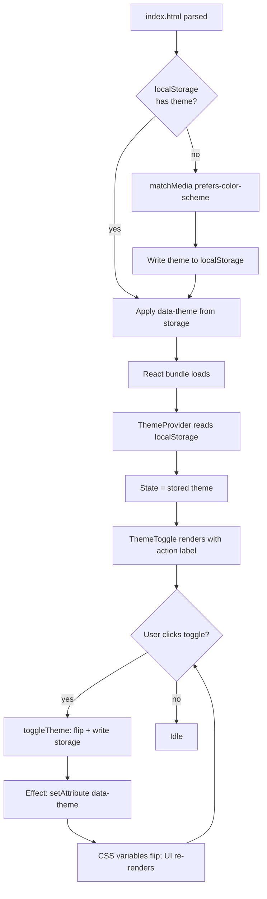

# Design: Dark mode — fixed bottom-left toggle, two-state light/dark, persisted

## Approach

The feature has four moving parts:

1. **A versioned `localStorage` wrapper** (`themeStorage.ts`). One
   place to read and write the theme. Falls back to in-memory state
   when storage is unavailable (private windows, quota errors, SSR
   sneaks). Treats unrecognized stored values (e.g.
   `'system'` left over from a hypothetical future change) as
   "unset" rather than crashing.
2. **A `ThemeContext` provider** (`ThemeContext.tsx`). Owns the
   in-memory theme state, exposes `{ theme, toggleTheme, setTheme }`
   via `useTheme()`. On state change, writes to `themeStorage` and
   sets the `data-theme` attribute on `document.documentElement`.
   Mounted **above** `<AuthProvider>` in `main.tsx` so the
   `LoginPage` (which is not wrapped by `AuthedLayout`) can still
   read it.
3. **A `ThemeToggle` component** (`ThemeToggle.tsx`). A single
   `<button>` rendered as a fixed-position overlay in the bottom-left
   corner. Reads `useTheme()`, renders the action label
   (`Dark mode` / `Light mode`), and calls `toggleTheme()` on click.
   Rendered **once** at the React root (alongside `<App />` inside
   `<ThemeProvider>`) so it never unmounts across route changes.
4. **An inline boot script in `index.html`** that reads the persisted
   theme (or seeds it from `prefers-color-scheme`) and applies the
   `data-theme` attribute **before** the React bundle even loads. This
   eliminates the wrong-theme flash. The script is intentionally tiny
   (~15 lines) and does not need to handle every edge case the React
   layer handles — its only job is to set the attribute fast. The
   `<ThemeProvider>` re-reads `localStorage` on mount and converges
   to the same value, so any divergence between the boot script and
   the React layer is naturally healed on the first effect.

The CSS strategy is **CSS variables** declared at `:root` (the default,
which is the light theme) and overridden in a `[data-theme="dark"]`
block. Component CSS in `App.css` then references `var(--bg)`,
`var(--fg)`, `var(--border)`, etc. instead of literal colors. The few
existing rules that already use opacity-tinted neutrals
(`rgba(127, 127, 127, 0.3)`) are left as-is because they read
acceptably on both backgrounds and migrating them adds noise without
benefit. Each kept-literal rule gets a one-line comment justifying
the choice.

## Files to Modify

| File | Change Description |
|---|---|
| `frontend/index.html` | Insert a small inline `<script>` in `<head>` (before the existing `<title>` is fine; before `<body>` is required) that reads `localStorage.getItem('minimalist-app:theme:v1')`, falls back to `matchMedia('(prefers-color-scheme: dark)').matches ? 'dark' : 'light'`, writes the seeded value back to `localStorage` if it was missing, and sets `document.documentElement.setAttribute('data-theme', value)`. The script must be wrapped in a `try { ... } catch { /* in-memory only */ }` so it never throws and breaks page load. |
| `frontend/src/main.tsx` | Add `import { ThemeProvider } from './theme/ThemeContext';` and `import { ThemeToggle } from './theme/ThemeToggle';`. Wrap the React tree as `<StrictMode><ThemeProvider><BrowserRouter><AuthProvider><App /></AuthProvider></BrowserRouter><ThemeToggle /></ThemeProvider></StrictMode>`. The `<ThemeToggle>` is rendered as a sibling of `<BrowserRouter>` so it is always mounted (it does not need router context — it just calls `useTheme()`). It is positioned via CSS, not via DOM placement. |
| `frontend/src/index.css` | Replace the current `:root` block with a CSS-variable-based palette: `--bg`, `--fg`, `--fg-muted`, `--border`, `--accent`, `--surface`, `--danger-bg`, `--danger-fg`, `--success-bg`, `--success-fg`. Define light values on `:root` (this is the default, matching the explicit `data-theme="light"` we always set). Override with `[data-theme="dark"] { ... }`. Keep `color-scheme: light dark;` so native form controls (scrollbars, default `<input>` chrome) pick a reasonable variant. **Remove** the existing `@media (prefers-color-scheme: light)` block — the seed script has supplanted it. The `body { ... }` and `#root { ... }` rules are unchanged. |
| `frontend/src/App.css` | Migrate hard-coded colors to variables where the migration is clean (e.g. `rgba(255, 255, 255, 0.02)` -> `var(--surface)`). Leave opacity-tinted neutrals (`rgba(127, 127, 127, 0.3)`) and the danger / success accents alone — they read acceptably on both themes. Do **not** restructure selectors; do **not** rename classes. The diff should be small and surgical. |
| `frontend/README.md` | In the **Testing** section, update the bullet that lists the e2e specs to include `theme.spec.ts` alongside `login.spec.ts` and `profile.spec.ts`. Update the `bun run test:e2e` row of the Scripts table to mention all three specs. |
| `docs/specs/README.md` | Append a feature-roster row for `feat_frontend_004`. |
| `docs/tracking/features.md` | Append a tracker row. Backfill `Spec PR` and `Issues` columns after `gh pr create` / `gh issue create`. |

## Files to Create

| File | Purpose |
|---|---|
| `frontend/src/theme/themeStorage.ts` | Versioned `localStorage` wrapper. Exports `STORAGE_KEY`, `Theme`, `readTheme()`, `writeTheme(theme)`, `seedFromMedia()`. `readTheme()` returns `Theme \| null`. Unrecognized values return `null` (treated as "unset"). All functions guard `try { ... } catch { ... }` and fall through to an in-memory module-level variable when `localStorage` throws. |
| `frontend/src/theme/ThemeContext.tsx` | `ThemeProvider` and `useTheme()` hook. Initial state is read from `themeStorage.readTheme()`; if `null`, calls `seedFromMedia()` to derive and persist. The provider's effect applies `data-theme` to `<html>` whenever the state changes (idempotent — re-applying the same value is a no-op). The hook returns `{ theme, setTheme, toggleTheme }`. Throws if used outside the provider, mirroring `useAuth()`. |
| `frontend/src/theme/ThemeToggle.tsx` | The fixed-position button. Reads `useTheme()`. Renders `<button class="theme-toggle" ...>{label}</button>` where `label` is `Dark mode` when `theme === 'light'` and `Light mode` when `theme === 'dark'`. Has `data-testid="theme-toggle"` for the e2e spec. CSS for the fixed positioning lives in `App.css` under a new `feat_frontend_004` comment block. |
| `frontend/tests/e2e/theme.spec.ts` | Playwright e2e spec. See **Playwright spec contract** below. |

No file is deleted. No file under `backend/`, `infra/`, or `tests/`
(REST suite) is touched.

## Inline boot script — exact shape

The boot script in `index.html` is the most subtle piece because it
must be:

- Synchronous (so the attribute is set before first paint).
- Defensive (so `localStorage` errors do not break page load).
- Idempotent with the React layer (the `ThemeProvider` will re-read
  on mount — both must arrive at the same value).
- Tiny (we are inlining JavaScript in `index.html`; small is good).

Recommended shape:

```html
<script>
  (function () {
    try {
      var KEY = 'minimalist-app:theme:v1';
      var stored = localStorage.getItem(KEY);
      var theme;
      if (stored === 'light' || stored === 'dark') {
        theme = stored;
      } else {
        var prefersDark =
          typeof window.matchMedia === 'function' &&
          window.matchMedia('(prefers-color-scheme: dark)').matches;
        theme = prefersDark ? 'dark' : 'light';
        try { localStorage.setItem(KEY, theme); } catch (_e) {}
      }
      document.documentElement.setAttribute('data-theme', theme);
    } catch (_e) {
      // localStorage unavailable (private mode, etc.). Fall back to OS
      // preference for this page load only; React's ThemeProvider will
      // converge on the same value on mount.
      try {
        var prefersDark2 =
          typeof window.matchMedia === 'function' &&
          window.matchMedia('(prefers-color-scheme: dark)').matches;
        document.documentElement.setAttribute(
          'data-theme', prefersDark2 ? 'dark' : 'light'
        );
      } catch (_e2) {
        document.documentElement.setAttribute('data-theme', 'light');
      }
    }
  })();
</script>
```

The script is plain ES5 (no `let`/`const`/arrow) so it runs without
transpilation in any browser the project targets. It is placed inside
`<head>` after `<meta charset>` and `<meta viewport>` and before
`<title>`. Vulcan must verify the script is **not** processed by Vite's
HTML pipeline in a way that strips it (Vite leaves inline `<script>` in
`index.html` alone by default — confirmed by reading
`frontend/index.html`).

## Component sketch — `themeStorage.ts`

```ts
/**
 * Versioned localStorage wrapper for the user's theme choice.
 *
 * One key, two values, one media query. Falls back to an in-memory
 * variable when localStorage throws (private windows, quota errors).
 */

export const STORAGE_KEY = 'minimalist-app:theme:v1';

export type Theme = 'light' | 'dark';

let inMemory: Theme | null = null;

export function readTheme(): Theme | null {
  try {
    const raw = window.localStorage.getItem(STORAGE_KEY);
    if (raw === 'light' || raw === 'dark') return raw;
    return null;
  } catch {
    return inMemory;
  }
}

export function writeTheme(theme: Theme): void {
  inMemory = theme;
  try {
    window.localStorage.setItem(STORAGE_KEY, theme);
  } catch {
    // private window / quota — keep in-memory fallback
  }
}

export function seedFromMedia(): Theme {
  let prefersDark = false;
  try {
    prefersDark = window.matchMedia('(prefers-color-scheme: dark)').matches;
  } catch {
    prefersDark = false;
  }
  const theme: Theme = prefersDark ? 'dark' : 'light';
  writeTheme(theme);
  return theme;
}
```

## Component sketch — `ThemeContext.tsx`

```tsx
import {
  createContext,
  useCallback,
  useContext,
  useEffect,
  useMemo,
  useState,
  type ReactNode,
} from 'react';
import { readTheme, seedFromMedia, writeTheme, type Theme } from './themeStorage';

interface ThemeContextValue {
  theme: Theme;
  setTheme: (t: Theme) => void;
  toggleTheme: () => void;
}

const ThemeContext = createContext<ThemeContextValue | null>(null);

interface ThemeProviderProps {
  children: ReactNode;
}

export function ThemeProvider({ children }: ThemeProviderProps) {
  // Initial state must be synchronous to avoid a wrong-theme flash on
  // the React render after the inline boot script has already set the
  // attribute. We read storage; if missing, we seed (which writes).
  const [theme, setThemeState] = useState<Theme>(() => {
    return readTheme() ?? seedFromMedia();
  });

  // Apply data-theme on every change. The inline boot script already
  // set this once before React mounted; this effect keeps the DOM and
  // React state in sync on subsequent toggles.
  useEffect(() => {
    document.documentElement.setAttribute('data-theme', theme);
  }, [theme]);

  const setTheme = useCallback((t: Theme) => {
    writeTheme(t);
    setThemeState(t);
  }, []);

  const toggleTheme = useCallback(() => {
    setThemeState((prev) => {
      const next: Theme = prev === 'light' ? 'dark' : 'light';
      writeTheme(next);
      return next;
    });
  }, []);

  const value = useMemo<ThemeContextValue>(
    () => ({ theme, setTheme, toggleTheme }),
    [theme, setTheme, toggleTheme],
  );

  return <ThemeContext.Provider value={value}>{children}</ThemeContext.Provider>;
}

export function useTheme(): ThemeContextValue {
  const ctx = useContext(ThemeContext);
  if (ctx === null) {
    throw new Error('useTheme() must be used inside a <ThemeProvider>');
  }
  return ctx;
}
```

## Component sketch — `ThemeToggle.tsx`

```tsx
import { useTheme } from './ThemeContext';

export function ThemeToggle() {
  const { theme, toggleTheme } = useTheme();
  const label = theme === 'light' ? 'Dark mode' : 'Light mode';

  return (
    <button
      type="button"
      className="theme-toggle"
      onClick={toggleTheme}
      data-testid="theme-toggle"
      aria-label={`Switch to ${label.toLowerCase()}`}
    >
      {label}
    </button>
  );
}
```

## Updated `main.tsx`

```tsx
import { StrictMode } from 'react';
import { createRoot } from 'react-dom/client';
import { BrowserRouter } from 'react-router-dom';
import './index.css';
import App from './App.tsx';
import { AuthProvider } from './auth/AuthContext';
import { ThemeProvider } from './theme/ThemeContext';
import { ThemeToggle } from './theme/ThemeToggle';

const rootElement = document.getElementById('root');
if (!rootElement) {
  throw new Error('Root element #root not found in index.html');
}

createRoot(rootElement).render(
  <StrictMode>
    <ThemeProvider>
      <BrowserRouter>
        <AuthProvider>
          <App />
        </AuthProvider>
      </BrowserRouter>
      <ThemeToggle />
    </ThemeProvider>
  </StrictMode>,
);
```

`<ThemeToggle />` is a sibling of `<BrowserRouter>`, not a child — it
does not need routing context. It is rendered **outside** the router,
so it is unaffected by route changes (no remount, no `useLocation`
dependency, no risk of `<RequireAuth>` redirect logic skipping it).

## CSS — variable palette in `index.css`

```css
:root {
  font-family: system-ui, -apple-system, 'Segoe UI', Roboto, Helvetica, Arial,
    sans-serif;
  line-height: 1.5;
  color-scheme: light dark;

  /* Light theme (default). */
  --bg: #ffffff;
  --fg: #213547;
  --fg-muted: rgba(33, 53, 71, 0.7);
  --border: rgba(0, 0, 0, 0.15);
  --surface: rgba(0, 0, 0, 0.025);
  --accent: rgba(70, 130, 220, 0.85);
  --accent-bg: rgba(70, 130, 220, 0.1);
  --danger-fg: rgb(180, 30, 30);
  --danger-border: rgba(180, 30, 30, 0.5);
  --danger-bg: rgba(180, 30, 30, 0.06);
  --success-fg: rgb(20, 120, 60);
  --success-border: rgba(20, 120, 60, 0.45);
  --success-bg: rgba(20, 120, 60, 0.08);

  color: var(--fg);
  background-color: var(--bg);
}

[data-theme="dark"] {
  --bg: #242424;
  --fg: rgba(255, 255, 255, 0.87);
  --fg-muted: rgba(255, 255, 255, 0.6);
  --border: rgba(255, 255, 255, 0.18);
  --surface: rgba(255, 255, 255, 0.04);
  --accent: rgba(100, 160, 255, 0.85);
  --accent-bg: rgba(100, 160, 255, 0.12);
  --danger-fg: rgb(255, 120, 120);
  --danger-border: rgba(220, 50, 50, 0.5);
  --danger-bg: rgba(220, 50, 50, 0.08);
  --success-fg: rgb(120, 220, 160);
  --success-border: rgba(50, 180, 100, 0.5);
  --success-bg: rgba(50, 180, 100, 0.08);
}

body {
  margin: 0;
  min-height: 100vh;
  display: flex;
  place-items: center;
  justify-content: center;
}

#root {
  width: 100%;
  max-width: 48rem;
  margin: 0 auto;
  padding: 2rem;
}
```

The current `@media (prefers-color-scheme: light)` block is removed.
The seed script in `index.html` and the `ThemeProvider` together
guarantee `data-theme` is always set, so the default rules at
`:root` are the light values (matching what `data-theme="light"`
would also produce — they are intentionally identical).

## CSS — `App.css` migrations (selective)

The migration is intentionally narrow. Only rules that have a clean
mapping to a variable get migrated; the rest stay literal. Examples:

| Existing literal | Migrate to | Reasoning |
|---|---|---|
| `background-color: rgba(255, 255, 255, 0.02);` (login-page, auth-header) | `background-color: var(--surface);` | Direct semantic match. |
| `border: 1px solid rgba(127, 127, 127, 0.3);` (state, hello-panel) | **keep literal** | Opacity-tinted neutral reads on both themes; rewriting adds churn without payoff. |
| `outline: 2px solid rgba(100, 160, 255, 0.6);` (focus rings) | **keep literal** | Focus accent is theme-invariant by design (visible on both bg). |
| `background-color: rgba(220, 50, 50, 0.08);` (login-form__error) | `background-color: var(--danger-bg);` | Direct match. |
| `border-color: rgba(220, 50, 50, 0.5);` (login-form__error) | `border-color: var(--danger-border);` | Direct match. |
| `background-color: rgba(50, 180, 100, 0.08);` (login-form__info) | `background-color: var(--success-bg);` | Direct match. |
| `border-color: rgba(50, 180, 100, 0.5);` (login-form__info) | `border-color: var(--success-border);` | Direct match. |
| `background-color: rgba(100, 160, 255, 0.12);` (login-form__submit) | `background-color: var(--accent-bg);` | Direct match. |

Vulcan applies the migrations row by row and leaves a one-line
`feat_frontend_004` comment above each migrated rule (or one block-
comment at the top of the section) so the diff is easy to audit.

## CSS — toggle button in `App.css`

```css
/* ---- feat_frontend_004: theme toggle (fixed bottom-left) -------------- */

.theme-toggle {
  position: fixed;
  bottom: 1rem;
  left: 1rem;
  z-index: 10;
  padding: 0.5rem 0.85rem;
  font-size: 0.85rem;
  border-radius: 0.4rem;
  border: 1px solid var(--border);
  background-color: var(--surface);
  color: var(--fg);
  cursor: pointer;
  font-family: inherit;
  /* No transition — flip is instant per the design. */
}

.theme-toggle:hover {
  background-color: var(--accent-bg);
}

.theme-toggle:focus-visible {
  outline: 2px solid rgba(100, 160, 255, 0.6);
  outline-offset: 1px;
}
```

`z-index: 10` is intentionally low — the page does not currently use
any layered overlay, modal, or toast. If a future feature adds a modal
that should occlude the toggle, that feature can bump the modal's
`z-index` above 10. Keeping the toggle at a small value avoids
arms-race escalation.

## Data Flow



After the boot script and `ThemeProvider` converge, every subsequent
toggle is a single round trip: button click -> state update -> effect
applies attribute -> CSS variables resolve -> repaint.

## Routing / mount-tree contract

The provider tree becomes:

```
<StrictMode>
  <ThemeProvider>            <- new, outermost (so /login can read it too)
    <BrowserRouter>
      <AuthProvider>
        <App />              <- routes: /login, /, /profile, *
      </AuthProvider>
    </BrowserRouter>
    <ThemeToggle />          <- always mounted; not affected by route changes
  </ThemeProvider>
</StrictMode>
```

`<ThemeProvider>` is the outermost provider — even outside
`<BrowserRouter>` — so it does not depend on routing context. The
`<ThemeToggle>` is rendered as a sibling of `<BrowserRouter>` so
the route table never unmounts it. `<AuthProvider>` continues to live
where it is today.

## Edge Cases & Risks

| Risk | Mitigation |
|---|---|
| Wrong-theme flash between HTML parse and React mount. | Inline boot script in `index.html` sets `data-theme` before any React code runs. The `ThemeProvider` re-reads the same value and converges. |
| `localStorage` is disabled (private window / Safari ITP). | `themeStorage` catches and falls back to an in-memory variable. Theme works **within** a session but resets on reload. The boot script also catches and falls back to OS preference. No crash. |
| `localStorage` contains an unexpected value (e.g. `'system'` from a future change, or hand-edited). | `readTheme()` returns `null` for unrecognized values. The provider then re-seeds from the OS preference. |
| Two tabs open and the user toggles in one — does the other tab update? | No. Cross-tab `storage` events are intentionally not wired in this feature. Documented as out-of-scope. A future feature may add a `storage` event listener. |
| The user's OS changes `prefers-color-scheme` while the app is open — should the app react? | No. Once a value is in `localStorage`, the user's choice is sticky. Documented as the explicit design (per the user's "more functional than decorative" guidance). |
| StrictMode double-mounts the provider in dev. | The provider's `useState` initializer runs twice in dev, but both runs read the same persisted value. The effect that sets `data-theme` is idempotent (same value -> same DOM). No observable difference. |
| Theme toggle button overlaps page content on small viewports. | `position: fixed; bottom: 1rem; left: 1rem;` puts it in a low-traffic corner. The login form is centered (`max-width: 26rem; margin: 4rem auto;`), the dashboard is left-aligned within the centered `#root`. The toggle does not currently overlap any interactive element. If a future page adds bottom-left content, that feature owns the layout fix. |
| `data-theme` attribute is set on `<html>`, not `<body>` — does that interfere with anything? | No. `<html>` is the recommended target because CSS variables on `:root` and a sibling `[data-theme="dark"]` selector resolve identically (`:root` and `html` are the same element). The cascade is unambiguous. |
| Existing tests (`login.spec.ts`, `profile.spec.ts`) break because the theme toggle adds an unexpected element. | The toggle has `data-testid="theme-toggle"` and is positioned via `position: fixed`. None of the existing specs use a global query for `<button>` or rely on element counts. Vulcan must verify locally; if any spec uses `page.getByRole('button')` without a name, it would now find an extra match — none currently do. |
| Inline boot script fails Content-Security-Policy in a future hardening feature. | The script is currently allowed by default (no CSP shipped). When a future feature adds a CSP, that feature owns moving the script to a hashed inline or an external file. Out of scope here. |
| Light theme has insufficient contrast on accent-tinted elements. | The chosen palette has been picked to keep WCAG AA ratios on body text (`#213547` on `#ffffff` is ~12:1). Accent-tinted backgrounds (`var(--accent-bg)`) are decorative; text inside them inherits `var(--fg)` which carries the contrast. Vulcan must spot-check the login error / info banners in both themes during the build. |
| Vite or browser caching serves a stale `index.html` after the inline script changes. | Vite's dev server hot-reloads `index.html`. Production builds emit a fresh `index.html` per build. No special action needed. |
| `ThemeProvider` wraps `<BrowserRouter>` — does any code expect `useNavigate()` or `useLocation()` inside the theme layer? | No. The `ThemeContext` does not call any router hook. The `ThemeToggle` does not navigate. |

## Playwright spec contract — `theme.spec.ts`

The spec runs against the compose stack but does **not** require the
OTP fixture (no login is performed). Its assertions all happen on
`/login` (and on the `/login` redirect from `/`). It uses Playwright's
`page.emulateMedia({ colorScheme: 'dark' | 'light' })` to control the
seed-from-OS path.

```ts
import { test, expect } from '@playwright/test';

test.describe('theme toggle', () => {
  test('first visit seeds from OS preference (dark)', async ({ page }) => {
    await page.emulateMedia({ colorScheme: 'dark' });
    await page.addInitScript(() => {
      try { window.localStorage.removeItem('minimalist-app:theme:v1'); } catch {}
    });
    await page.goto('/login');
    const theme = await page.evaluate(() =>
      document.documentElement.getAttribute('data-theme'),
    );
    expect(theme).toBe('dark');
  });

  test('first visit seeds from OS preference (light)', async ({ page }) => {
    await page.emulateMedia({ colorScheme: 'light' });
    await page.addInitScript(() => {
      try { window.localStorage.removeItem('minimalist-app:theme:v1'); } catch {}
    });
    await page.goto('/login');
    const theme = await page.evaluate(() =>
      document.documentElement.getAttribute('data-theme'),
    );
    expect(theme).toBe('light');
  });

  test('toggle flips theme and persists across reload', async ({ page }) => {
    await page.emulateMedia({ colorScheme: 'light' });
    await page.addInitScript(() => {
      try { window.localStorage.removeItem('minimalist-app:theme:v1'); } catch {}
    });
    await page.goto('/login');

    // Initial: light (seeded).
    expect(
      await page.evaluate(() =>
        document.documentElement.getAttribute('data-theme'),
      ),
    ).toBe('light');
    await expect(page.getByTestId('theme-toggle')).toHaveText('Dark mode');

    // Click toggle.
    await page.getByTestId('theme-toggle').click();
    expect(
      await page.evaluate(() =>
        document.documentElement.getAttribute('data-theme'),
      ),
    ).toBe('dark');
    await expect(page.getByTestId('theme-toggle')).toHaveText('Light mode');

    // Reload — theme persists, no flash of wrong theme.
    await page.reload();
    const themeOnReload = await page.evaluate(() =>
      document.documentElement.getAttribute('data-theme'),
    );
    expect(themeOnReload).toBe('dark');
    await expect(page.getByTestId('theme-toggle')).toHaveText('Light mode');
  });

  test('user choice overrides OS preference', async ({ page }) => {
    await page.emulateMedia({ colorScheme: 'light' });
    await page.addInitScript(() => {
      try { window.localStorage.removeItem('minimalist-app:theme:v1'); } catch {}
    });
    await page.goto('/login');

    // User picks dark.
    await page.getByTestId('theme-toggle').click();
    expect(
      await page.evaluate(() =>
        document.documentElement.getAttribute('data-theme'),
      ),
    ).toBe('dark');

    // OS preference flips to dark anyway.
    await page.emulateMedia({ colorScheme: 'dark' });
    await page.reload();

    // User's stored choice still wins (still dark — but the test is
    // really: re-emulate to LIGHT and verify we DO NOT flip back).
    await page.emulateMedia({ colorScheme: 'light' });
    await page.reload();
    expect(
      await page.evaluate(() =>
        document.documentElement.getAttribute('data-theme'),
      ),
    ).toBe('dark');
  });

  test('toggle button is visible on / -> redirect to /login', async ({ page }) => {
    await page.addInitScript(() => {
      try { window.localStorage.removeItem('minimalist-app:theme:v1'); } catch {}
    });
    await page.goto('/');
    await expect(page).toHaveURL(/\/login$/);
    await expect(page.getByTestId('theme-toggle')).toBeVisible();
  });
});
```

The spec is self-contained: it does not import `getOtpFixture`, does
not call `test.skip` on missing fixture, and does not perform any
OTP flow. It does require the compose stack to be up (so `/login`
serves a real page) — same prerequisite as `login.spec.ts`.

## Verification matrix

| Theme | Page | Manual check |
|---|---|---|
| light | `/login` | Email input border visible against white bg; error banner red on light pink; submit button accent-tinted but readable. |
| light | `/` (authed) | Header strip visible; role chips readable; HelloPanel border visible. |
| light | `/profile` | Email value readable in monospace; heading contrast OK. |
| dark | `/login` | Matches today's look (no regression). |
| dark | `/` | Matches today's look. |
| dark | `/profile` | Matches today's look. |

Vulcan should screenshot each combination during the build and attach
them to the build PR description for human review.

## Dependencies

- **Hard:** `feat_frontend_003` merged to `main` first.
- **Runtime (no new):** `react`, `react-dom`, `react-router-dom@^7`
  (all already pulled in by `feat_frontend_001` / `feat_frontend_002`).
- **Dev (no new):** `@playwright/test@^1` (already present).
- **External tools (no new):** Playwright Chromium, already installed
  per the README's e2e-setup instructions.
- **Backend:** unchanged.

## Deviations

- **OS preference is consulted only on first visit and never again.**
  The user did not explicitly direct this; Atlas decided it is the
  most sensible behavior given the user's "user's choice owns it"
  guidance and the explicit 2-state requirement. Documented in the
  feature spec under Requirements; flagged here for the user's
  review. If the user prefers "watch OS preference on every load
  until the user toggles once," that is a one-line change in
  `themeStorage.ts` (we would not write the seed back to storage,
  and we'd re-read the media query on each page load while
  `localStorage` is empty).
- **No system / auto state.** Per the user's explicit choice.
- **No side pane.** Per the user's explicit choice (Option B).
- **No `storage` event listener for cross-tab sync.** Out of scope;
  documented as a future-feature opportunity.
- **Light theme is functional, not designed.** Per the user's "more
  functional than decorative" guidance. The palette is conservative
  and may be tuned in a follow-up feature.
- **Inline boot script is plain ES5.** Even though the rest of the app
  is TypeScript-targeted-ESNext, the boot script is hand-written in
  ES5 to avoid any transpilation surprises and to keep the logic
  trivially auditable in the deployed `index.html`.
- **Branch and directory use `feat_<domain>_<NNN>` only.** No slug,
  matching `conventions.md` §2 and every existing sibling under
  `docs/specs/`.
