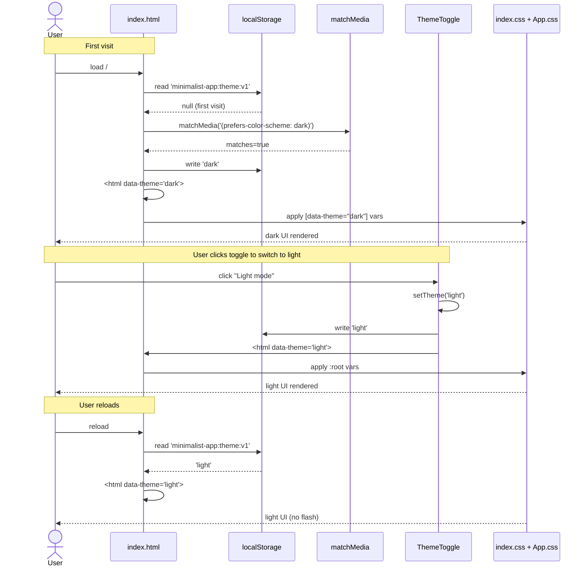

# Feature: Dark mode — fixed bottom-left toggle, two-state light/dark, persisted

## Problem Statement

The frontend currently ships a single, hard-coded color scheme defined
in `frontend/src/index.css`. The `:root` selector sets a near-black
background (`#242424`) with light text, and a `@media (prefers-color-scheme: light)`
override flips both back to white-on-dark-text. The result is that the
**operating system's** preference picks the theme — the user has no
in-app control. There is also no `data-theme` hook, no theme context,
and no persistence layer; component CSS in `App.css` hard-codes
opacity-tinted neutrals (`rgba(127, 127, 127, ...)`, `rgba(255, 255, 255, 0.02)`)
that happen to look reasonable on either background but were never
designed against an explicit palette.

This feature gives the user a deliberate, in-app toggle between a
**light** and **dark** theme. The toggle is rendered as a fixed
bottom-left button on every page (authed and unauthenticated, including
`/login`). Clicking it flips the theme, applies it instantly via a
`data-theme` attribute on `<html>`, and persists the choice to
`localStorage` so a refresh, a new tab, or a new browser session lands
on the same theme. The user's explicit choice is sticky — the OS
`prefers-color-scheme` media query is consulted **only** as the seed
on first visit and is never read again afterward.

The implementation introduces a small `ThemeContext` provider mounted
above `AuthProvider`, a tiny `themeStorage` module that wraps
`localStorage`, and a CSS-variable palette in `index.css` with
`[data-theme="dark"]` overrides. Component CSS in `App.css` is migrated
to reference the new variables, but the visual look on the dark theme
matches the current screen pixel-for-pixel where reasonable; the light
theme is a new but minimal palette.

## Requirements

- A new in-app **theme toggle** is rendered as a fixed-position button
  in the **bottom-left corner** of the viewport. It sits above page
  content (small z-index) and is visible on every route, including
  `/login` (unauthenticated) and the bootstrap-loading state. It does
  **not** appear inside `<Header>`; it is a global overlay button
  rendered by the new `<ThemeProvider>` (or a small sibling component
  rendered alongside it).
- The toggle has exactly **two states**: `light` and `dark`. There is
  no `system` / `auto` state, no tri-state cycle, no dropdown.
  Clicking the button flips between the two states.
- The currently-applied theme is reflected by a `data-theme="light"` or
  `data-theme="dark"` attribute on the `<html>` element. CSS rules in
  `index.css` and `App.css` reference theme variables (e.g.
  `--bg`, `--fg`, `--border`, `--muted`, `--accent`) defined at
  `:root` (light defaults) and overridden by `[data-theme="dark"]`.
- The user's choice is persisted to `localStorage` under a single
  versioned key (`minimalist-app:theme:v1`). Reads and writes go
  through a small `themeStorage` module that handles
  unavailable-storage edge cases (private windows, quota errors,
  `localStorage` disabled) by falling back to in-memory state without
  throwing.
- On **first visit** (no value in `localStorage`), the initial theme
  is seeded from `window.matchMedia('(prefers-color-scheme: dark)').matches`
  — `true` -> `dark`, `false` -> `light`. The seeded value is written
  to `localStorage` immediately so subsequent renders, refreshes, and
  tabs all read the same value. After the seed, `prefers-color-scheme`
  is **never** consulted again — the user's explicit choice owns the
  theme forever.
- A small **inline script** in `index.html` reads the persisted theme
  (or seeds it) **before** React mounts, and applies the
  `data-theme` attribute on `<html>` synchronously. This eliminates
  the brief "wrong-theme flash" that would otherwise occur between the
  HTML being parsed and the `<ThemeProvider>` running its effect.
- A new **`ThemeContext`** provides `{ theme: 'light' | 'dark', toggleTheme: () => void, setTheme: (t) => void }`.
  It is mounted in `main.tsx` **above** `<AuthProvider>` so every
  React subtree (including the `LoginPage` route) can read and write
  the theme.
- The toggle button shows a clear, accessible label that reflects the
  **action**, not the current state. Recommended copy: when the
  current theme is `light`, the button reads `Dark mode` (because
  clicking it switches to dark); when current is `dark`, it reads
  `Light mode`. Vulcan may also use icon-only with `aria-label`,
  but a text-only button is acceptable and consistent with the
  bland-Vite tone.
- Existing component visuals must not regress on the dark theme.
  `App.css` selectors that hard-code colors (e.g.
  `rgba(220, 50, 50, 0.5)` on `.login-form__error`, the role chip
  borders, the `.state` panel) are migrated to CSS variables where
  the variable cleanly applies; otherwise the literal stays and is
  documented as intentionally theme-invariant.
- Light theme styling is "good enough": readable contrast, no white
  text on white background. It does **not** need to win a design
  award — the user said "more functional than decorative". Dark
  theme remains the close cousin of today's look.
- A new **Playwright e2e spec** at `frontend/tests/e2e/theme.spec.ts`
  drives the toggle end-to-end on `/login` (no login required, since
  the toggle works pre-auth too): assert initial theme, click toggle,
  assert `data-theme` flipped and the button label changed, reload
  the page, assert the theme persisted, navigate to `/` (which
  redirects to `/login`), assert the theme is still applied. The
  spec runs without the OTP fixture — it asserts no `/auth/me`
  re-fire is needed for theme behavior — so it does **not** call
  `test.skip` based on `getOtpFixture()`.
- No backend changes. The theme is a pure-frontend concern; the
  `Me` payload is unchanged; no new API endpoints; no DB migrations.
- `./test.sh` continues to pass with no behavior change. The new
  Playwright spec runs via `bun run test:e2e` alongside the existing
  specs.

## User Stories

- As a user who prefers a light interface during the day, I want a
  visible toggle on every page so I can switch out of dark mode
  without hunting through a settings menu.
- As a user who prefers a dark interface, I want my choice to stick
  across sessions so I do not have to re-toggle every time I open
  the app.
- As a first-time visitor, I want the app to start in whichever theme
  matches my OS preference so the initial render does not feel
  jarring.
- As a user signing in, I want the theme toggle to be reachable from
  the `/login` page so I can pick my preferred theme before I even
  authenticate.
- As a user reloading the page, I want no flash of the wrong theme
  between page parse and React mount.
- As a user with `localStorage` disabled (private window), I want the
  app to keep working — the theme just resets when I navigate
  between pages, instead of crashing.

## User Flow

## Scope

### In Scope

- New file `frontend/src/theme/themeStorage.ts` — read/write with the
  versioned key, in-memory fallback, sensible types.
- New file `frontend/src/theme/ThemeContext.tsx` — provider + hook
  (`useTheme`).
- New file `frontend/src/theme/ThemeToggle.tsx` — the fixed
  bottom-left button.
- Edit to `frontend/src/main.tsx` — mount `<ThemeProvider>` above
  `<AuthProvider>` and render `<ThemeToggle />` somewhere globally
  (recommended: inside `<ThemeProvider>` via a child portal or as a
  fixed sibling in `App` — see the design spec for the exact shape).
- Edit to `frontend/index.html` — small inline `<script>` that seeds
  + applies `data-theme` before React mounts.
- Edit to `frontend/src/index.css` — define a CSS-variable palette
  on `:root` (light) and `[data-theme="dark"]` (dark). Remove the
  current `prefers-color-scheme: light` media query (the seed script
  has replaced it). Keep `color-scheme` declared so form controls
  pick a sensible default.
- Edit to `frontend/src/App.css` — migrate hard-coded color rules
  to the new variable names where applicable. Document any rule
  that intentionally stays literal.
- New Playwright spec `frontend/tests/e2e/theme.spec.ts` covering
  the toggle / persistence / no-flash invariants.
- Update `frontend/README.md` Testing section to mention the new
  `theme.spec.ts`.
- Update `docs/specs/README.md` feature roster row.
- Update `docs/tracking/features.md` with a new row.

### Out of Scope

- **Side pane / settings drawer.** The user explicitly chose
  "toggle only" (Option B) and said "defer the side pane".
- **System / auto theme state.** The user explicitly chose 2-state
  only. No tri-state cycle, no `system` option in the toggle.
- **Per-user persistence on the backend.** The theme is local to the
  browser, not synced across devices. No DB column, no API endpoint.
- **Theme editor / color picker.** The user has a binary choice; no
  custom color UI.
- **Multiple light or dark variants** (e.g. high-contrast,
  sepia, solarized). One light, one dark.
- **Animated transitions** between themes (e.g. a CSS `transition`
  on `background-color`). The flip is instant. A future feature
  may add a transition.
- **Re-skinning the app.** The dark theme matches the current look
  closely. The light theme is functional, not redesigned.
- **Tailwind / CSS-in-JS migration.** The feature stays on the
  current `App.css` + `index.css` model; it just adds variables.
- **Backend changes of any kind.**
- **Component-level icons / icon library.** The toggle is a
  text-only button or a single inline emoji-free SVG. No new dep.
- **Honoring `prefers-color-scheme` changes after first visit.** Once
  the user has a stored preference, the OS preference no longer
  affects the app even if it changes. This is the explicit design.
- **A "reset to OS preference" affordance.** Could land in a future
  feature; not now.
- **Non-Chromium browser tests.** Playwright continues to drive
  Chromium only.
- **Adding the new spec to `./test.sh`.** Playwright stays out-of-band.

## Acceptance Criteria

- [ ] A fixed bottom-left button is visible on `/login` (unauthenticated)
      and on `/`, `/profile` (authed). It reads `Dark mode` when the
      current theme is light and `Light mode` when the current theme
      is dark.
- [ ] Clicking the toggle changes the `data-theme` attribute on
      `<html>` from `light` to `dark` (or vice versa) within the same
      tick.
- [ ] After clicking the toggle, `localStorage.getItem('minimalist-app:theme:v1')`
      reads back the new value (`'light'` or `'dark'`).
- [ ] After a full page reload, the previously-chosen theme is
      applied **before any visible flash of the other theme**. The
      Playwright spec asserts the `data-theme` is correct on the very
      first paint (using a synchronous evaluate before any
      interaction).
- [ ] On a fresh browser (no `localStorage` value), the initial theme
      matches the result of `matchMedia('(prefers-color-scheme: dark)')`.
      Playwright asserts this by emulating both color schemes and
      reloading.
- [ ] After a user has clicked the toggle once, changing the OS-level
      `prefers-color-scheme` does **not** change the in-app theme.
      Playwright asserts this by clicking the toggle, then emulating
      the opposite color scheme, then asserting the theme is still
      the user's choice.
- [ ] Navigating between routes (`/login` -> `/` after login -> `/profile`)
      preserves the theme. The toggle button stays in the same DOM
      position (rendered once, not unmounted across route changes).
- [ ] No new `fetch` is added to `frontend/src/`. (Theme is purely
      client-side.)
- [ ] No new dependency is added to `frontend/package.json`.
- [ ] `bun run build` passes with zero TypeScript errors.
- [ ] `frontend/tests/e2e/theme.spec.ts` exists and passes locally
      with `make up` running. It does **not** require the OTP
      fixture (no login dance).
- [ ] `frontend/tests/e2e/login.spec.ts` and
      `frontend/tests/e2e/profile.spec.ts` continue to pass with no
      changes (the theme toggle does not break their selectors or
      flows).
- [ ] `./test.sh` continues to pass.
- [ ] `docs/specs/README.md` and `docs/tracking/features.md` rows
      are present and reference this feature.

## Dependencies

- **Hard dependency:** `feat_frontend_003` merged to `main` first.
  This feature edits files (`main.tsx`, `index.html`, `index.css`,
  `App.css`, `frontend/README.md`) that already exist after
  `feat_frontend_003`. It does not touch any code that
  `feat_frontend_003` introduced (no edits to `ProfilePage.tsx` or
  `Header.tsx`), so a soft refactor in either direction is unlikely
  to conflict.
- No new runtime or dev dependencies. `react`, `react-dom`,
  `react-router-dom`, and `@playwright/test` are already in
  `package.json`.
